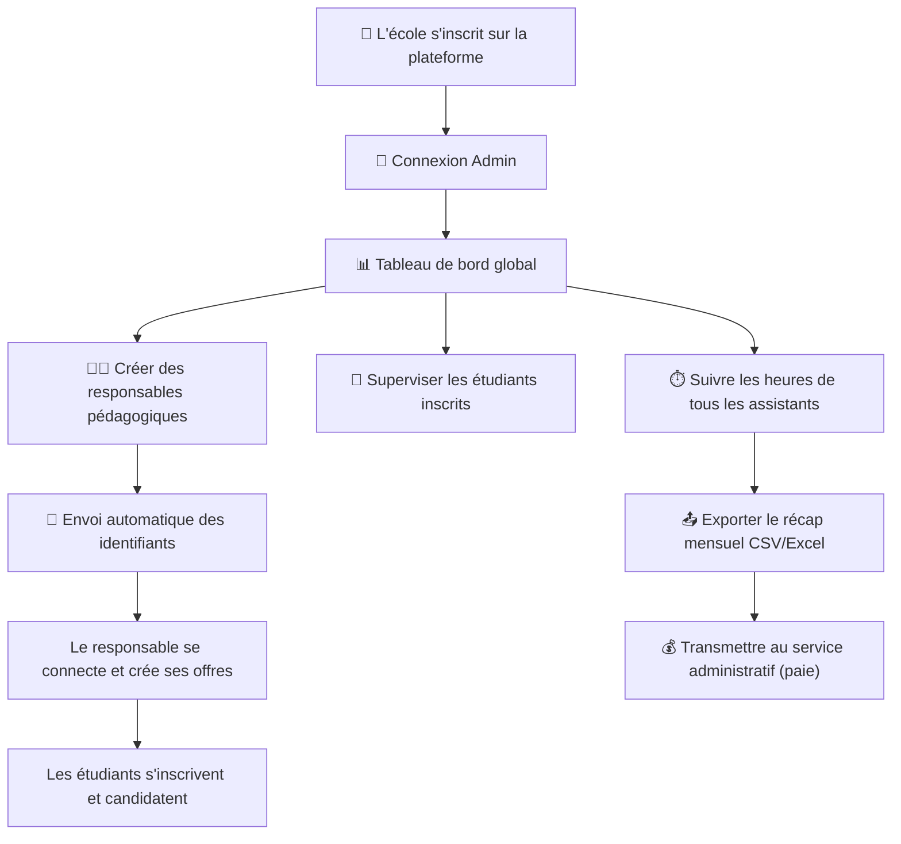

# 🏫 Espace Admin (École) — Documentation complète

## 🔄 Flux complet de l'admin



---

## 📌 Sidebar Admin

```
┌────────────────────────────┐
│  🏫 TP Assist — Admin      │
│────────────────────────────│
│  📊 Tableau de bord        │
│  👨‍🏫 Responsables      🔴 1 │  ← nb sans responsable
│  👥 Étudiants              │
│  ⏱️ Suivi des heures       │
│  📤 Export mensuel         │
│  ⚙️ Paramètres école       │
│────────────────────────────│
│  👤 Mon profil             │
│  🚪 Déconnexion            │
└────────────────────────────┘
```

---

---

## 📄 Page 1 — Tableau de bord global

### 📖 Description
Vue d'ensemble de toute l'activité de l'école : responsables actifs, étudiants inscrits, offres publiées, heures effectuées. C'est la **page d'accueil** de l'admin après connexion.

### ⚙️ Comportement
- Les **cartes statistiques** résument l'état global de l'école en un coup d'œil.
- Le bloc **"Activité récente"** montre les dernières actions : inscriptions d'étudiants, candidatures, heures validées.
- Le **graphique des heures** affiche une comparaison mois par mois (barres empilées validées / en attente / refusées).
- Les **alertes** signalent les situations qui nécessitent l'attention de l'admin (ex : responsable sans offre, étudiant IBAN manquant).
- Chaque carte est **cliquable** et redirige vers la page correspondante.

### 📝 Guide d'utilisation
1. **Consultez les cartes** pour un aperçu rapide de votre école.
2. **Vérifiez les alertes** → ex : un responsable n'a pas encore créé d'offre, un étudiant n'a pas renseigné son IBAN.
3. **Suivez l'activité récente** pour voir ce qui se passe en temps réel.
4. **Cliquez sur une carte** pour accéder à la page détaillée.

### Maquette

```
┌──────────────────────────────────────────────────────────────────────────┐
│  📊 Tableau de bord — ESCP Business School              🔔 2   👤 Admin│
│──────────────────────────────────────────────────────────────────────────│
│                                                                          │
│  ┌────────────┐  ┌────────────┐  ┌────────────┐  ┌────────────┐        │
│  │     4      │  │    23      │  │    12      │  │   156h     │        │
│  │  Respons.  │  │ Étudiants  │  │ Assistants │  │  Heures    │        │
│  │  actifs    │  │  inscrits  │  │  actifs    │  │  ce mois   │        │
│  │   👨‍🏫       │  │    👥      │  │    🎓      │  │    ⏱️      │        │
│  └────────────┘  └────────────┘  └────────────┘  └────────────┘        │
│                                                                          │
│  ┌────────────┐  ┌────────────┐  ┌────────────┐  ┌────────────┐        │
│  │     7      │  │    42      │  │   120h     │  │    28h     │        │
│  │  Offres    │  │  Séances   │  │  Validées  │  │  En att.   │        │
│  │  actives   │  │ ce mois    │  │    ✅       │  │    ⏳       │        │
│  │   📢       │  │    📅      │  │            │  │            │        │
│  └────────────┘  └────────────┘  └────────────┘  └────────────┘        │
│                                                                          │
│  ┌──────────────────────────────────────────────────────────────────┐   │
│  │  🚨 ALERTES                                                      │   │
│  │──────────────────────────────────────────────────────────────────│   │
│  │                                                                  │   │
│  │  ⚠️ 3 étudiants n'ont pas renseigné leur IBAN                   │   │
│  │     → Voir la liste                                             │   │
│  │                                                                  │   │
│  │  ⚠️ M. Bernard (Réseaux) n'a créé aucune offre depuis 30 jours │   │
│  │     → Contacter                                                 │   │
│  │                                                                  │   │
│  │  ⚠️ 28h en attente de validation (responsable : Mme Durand)    │   │
│  │     → Voir les heures                                           │   │
│  │                                                                  │   │
│  └──────────────────────────────────────────────────────────────────┘   │
│                                                                          │
│  ┌──────────────────────────────────┬───────────────────────────────┐   │
│  │  📈 Heures par mois              │  🕐 Activité récente         │   │
│  │──────────────────────────────────│───────────────────────────────│   │
│  │                                  │                               │   │
│  │  Sept  ██████████████░░ 112h     │  👤 Léa Martin s'est inscrite│   │
│  │  Oct   ████████████████░ 148h    │     Il y a 2h                │   │
│  │  Nov   ██████████░░░░░░  80h     │                               │   │
│  │                                  │  ✅ M. Ettori a validé 8h    │   │
│  │  ✅ Validées  ⏳ En attente      │     Il y a 5h                │   │
│  │  ❌ Refusées                     │                               │   │
│  │                                  │  📢 Mme Durand a créé        │   │
│  │                                  │     une offre "Java avancé"  │   │
│  │                                  │     Hier                      │   │
│  │                                  │                               │   │
│  └──────────────────────────────────┴───────────────────────────────┘   │
│                                                                          │
└──────────────────────────────────────────────────────────────────────────┘
```

---

---

## 📄 Page 2 — Gestion des Responsables pédagogiques

### 📖 Description
L'admin **crée les comptes** des responsables pédagogiques. Le responsable ne peut **pas s'inscrire lui-même** : c'est l'admin qui renseigne ses informations et lui envoie ses identifiants par email.

### ⚙️ Comportement
- La liste affiche tous les responsables avec leurs **statistiques** (nb offres, nb assistants, heures validées).
- Le bouton **"+ Ajouter un responsable"** ouvre le formulaire de création.
- À la création, un **mot de passe temporaire** est généré automatiquement.
- L'admin peut choisir d'**envoyer les identifiants par email** ou de les **copier manuellement** (pour les transmettre en main propre).
- L'admin peut **désactiver** un compte responsable (il ne pourra plus se connecter mais ses données sont conservées).
- L'admin peut **modifier** les informations d'un responsable (nom, email, département).
- **Supprimer** un responsable n'est possible que s'il n'a aucune offre active ni séance à venir.

### 📝 Guide d'utilisation
1. Cliquez **"+ Ajouter un responsable"** → remplissez le formulaire.
2. Cliquez **"Créer et envoyer les identifiants"** → le responsable reçoit un email avec son login + mot de passe temporaire.
3. À la première connexion, le responsable devra changer son mot de passe.
4. Pour modifier un responsable → cliquez ✏️ sur sa ligne.
5. Pour désactiver → cliquez 🔴. Le responsable ne pourra plus se connecter.
6. Consultez les stats de chaque responsable pour suivre leur activité.

### Maquette — Liste des responsables

```
┌──────────────────────────────────────────────────────────────────────────┐
│  👨‍🏫 Responsables pédagogiques                 ┌────────────────────────┐│
│                                                 │ + Ajouter un respons. ││
│                                                 └────────────────────────┘│
│──────────────────────────────────────────────────────────────────────────│
│                                                                          │
│  🔍 Rechercher un responsable...                                        │
│                                                                          │
│  ┌──────────────────────────────────────────────────────────────────┐   │
│  │                                                                  │   │
│  │  👨‍🏫 Eric Ettori                                   🟢 Actif      │   │
│  │  📧 e.ettori@escp.eu                                             │   │
│  │  🏛️ Département : Informatique                                   │   │
│  │  📊 3 offres · 5 assistants · 48h validées ce mois              │   │
│  │  📅 Dernière connexion : Aujourd'hui à 14h30                     │   │
│  │                                                                  │   │
│  │  ┌──────────┐  ┌──────────┐  ┌──────────────┐                  │   │
│  │  │ ✏️ Modif. │  │ 📧 Renvoyer│ │ 🔴 Désactiver│                  │   │
│  │  │          │  │ identif. │  │              │                  │   │
│  │  └──────────┘  └──────────┘  └──────────────┘                  │   │
│  └──────────────────────────────────────────────────────────────────┘   │
│                                                                          │
│  ┌──────────────────────────────────────────────────────────────────┐   │
│  │                                                                  │   │
│  │  👩‍🏫 Sophie Durand                                  🟢 Actif      │   │
│  │  📧 s.durand@escp.eu                                             │   │
│  │  🏛️ Département : Informatique                                   │   │
│  │  📊 2 offres · 3 assistants · 24h validées ce mois              │   │
│  │  📅 Dernière connexion : Hier à 09h15                            │   │
│  │                                                                  │   │
│  │  ┌──────────┐  ┌──────────┐  ┌──────────────┐                  │   │
│  │  │ ✏️ Modif. │  │ 📧 Renvoyer│ │ 🔴 Désactiver│                  │   │
│  │  └──────────┘  └──────────┘  └──────────────┘                  │   │
│  └──────────────────────────────────────────────────────────────────┘   │
│                                                                          │
│  ┌──────────────────────────────────────────────────────────────────┐   │
│  │                                                                  │   │
│  │  👨‍🏫 Marc Bernard                                  🔴 Désactivé   │   │
│  │  📧 m.bernard@escp.eu                                            │   │
│  │  🏛️ Département : Réseaux                                        │   │
│  │  📊 0 offres · 0 assistants · 0h ce mois                        │   │
│  │  📅 Dernière connexion : Il y a 45 jours                         │   │
│  │                                                                  │   │
│  │  ┌──────────┐  ┌──────────────┐  ┌──────────┐                  │   │
│  │  │ ✏️ Modif. │  │ 🟢 Réactiver │  │ 🗑️ Suppr. │                  │   │
│  │  └──────────┘  └──────────────┘  └──────────┘                  │   │
│  └──────────────────────────────────────────────────────────────────┘   │
│                                                                          │
└──────────────────────────────────────────────────────────────────────────┘
```

### Modal — Créer un responsable

```
┌───────────────────────────────────────────────────────────┐
│  👨‍🏫 Ajouter un responsable pédagogique                   │
│───────────────────────────────────────────────────────────│
│                                                           │
│  Nom *                        Prénom *                    │
│  ┌──────────────────┐         ┌──────────────────┐       │
│  │ Ettori           │         │ Eric             │       │
│  └──────────────────┘         └──────────────────┘       │
│                                                           │
│  Email professionnel *                                    │
│  ┌─────────────────────────────────────────┐              │
│  │ e.ettori@escp.eu                        │              │
│  └─────────────────────────────────────────┘              │
│  ✅ Le domaine correspond à votre école (@escp.eu)        │
│                                                           │
│  Département / Matière *                                  │
│  ┌─────────────────────────────────────────┐              │
│  │ Informatique                            │              │
│  └─────────────────────────────────────────┘              │
│                                                           │
│  Téléphone                                                │
│  ┌─────────────────────────────────────────┐              │
│  │ 01 49 23 20 15                          │              │
│  └─────────────────────────────────────────┘              │
│                                                           │
│  ┌─────────────────────────────────────────────────────┐  │
│  │  🔑 Mot de passe généré : Xk9$mP2wLq               │  │
│  │     (le responsable devra le changer à la           │  │
│  │      première connexion)                            │  │
│  │                       ┌──────────┐                  │  │
│  │                       │ 📋 Copier │                  │  │
│  │                       └──────────┘                  │  │
│  └─────────────────────────────────────────────────────┘  │
│                                                           │
│  Envoi des identifiants :                                 │
│  ☑ Envoyer par email automatiquement                      │
│  ☐ Ne pas envoyer (je transmettrai moi-même)              │
│                                                           │
│    ┌──────────┐    ┌─────────────────────────────┐       │
│    │ Annuler  │    │ Créer et envoyer les identif.│       │
│    └──────────┘    └─────────────────────────────┘       │
└───────────────────────────────────────────────────────────┘
```

### Confirmation après création

```
┌───────────────────────────────────────────────────────────┐
│  ✅ Responsable créé avec succès !                        │
│───────────────────────────────────────────────────────────│
│                                                           │
│  👨‍🏫 Eric Ettori                                          │
│  📧 Identifiants envoyés à : e.ettori@escp.eu            │
│                                                           │
│  Le responsable pourra se connecter immédiatement.        │
│  Il devra changer son mot de passe à la première          │
│  connexion.                                               │
│                                                           │
│              ┌──────────────────┐                         │
│              │      OK ✅       │                         │
│              └──────────────────┘                         │
└───────────────────────────────────────────────────────────┘
```

---

---

## 📄 Page 3 — Gestion des Étudiants

### 📖 Description
L'admin voit tous les étudiants inscrits dans son école. Il peut consulter leur profil, vérifier s'ils ont renseigné leur IBAN, et désactiver ou supprimer un compte si nécessaire.

### ⚙️ Comportement
- La liste affiche tous les étudiants avec un **badge** indiquant s'ils sont assistant actif ou non.
- Un **filtre rapide** permet de chercher par nom, filière ou statut.
- Le filtre **"⚠️ IBAN manquant"** montre les étudiants qui n'ont pas renseigné leurs coordonnées bancaires → l'admin peut leur envoyer un rappel.
- L'admin **ne peut pas modifier** les informations personnelles d'un étudiant (c'est l'étudiant qui gère son profil), mais il peut :
  - **Voir** le profil complet (lecture seule)
  - **Désactiver** un compte (l'étudiant ne peut plus se connecter)
  - **Supprimer** un compte (uniquement si l'étudiant n'a aucune heure validée en cours)
- L'admin peut voir si l'IBAN est renseigné ou non (mais **pas** le numéro IBAN lui-même pour des raisons de confidentialité → affiché masqué `FR76 **** **** **** 0123`).

### 📝 Guide d'utilisation
1. Consultez la liste pour voir tous les étudiants inscrits.
2. Utilisez le filtre **"⚠️ IBAN manquant"** pour identifier les étudiants à relancer.
3. Cliquez **"📧 Rappel IBAN"** pour envoyer un email de rappel automatique.
4. Cliquez **"👁️ Voir"** pour consulter le profil complet d'un étudiant.
5. Pour désactiver un étudiant problématique → cliquez **"🔴 Désactiver"**.

### Maquette

```
┌──────────────────────────────────────────────────────────────────────────┐
│  👥 Étudiants inscrits (23)                                             │
│──────────────────────────────────────────────────────────────────────────│
│                                                                          │
│  🔍 Rechercher...    Filtres : [Tous ▼] [Toutes filières ▼]            │
│                                [⚠️ IBAN manquant] [🎓 Assistants actifs]│
│                                                                          │
│  ┌────────────────────────────────────────────────────────────────────┐  │
│  │                                                                    │  │
│  │  Nom         │ Nº Étud. │ Filière    │ IBAN   │ Statut   │ Act.  │  │
│  │  ────────────┼──────────┼────────────┼────────┼──────────┼───────│  │
│  │  Léa Martin  │ 20230456 │ L3 Info    │ ✅ Oui  │ 🎓 Assist│ 👁️ ✏️ │  │
│  │  Paul Durand │ 20230789 │ M1 Info    │ ✅ Oui  │ 🎓 Assist│ 👁️ ✏️ │  │
│  │  Marie Lopez │ 20230123 │ L3 Info    │ ⚠️ Non  │ 🎓 Assist│ 👁️ 📧 │  │
│  │  Karim Hadj  │ 20240001 │ L2 Info    │ ⚠️ Non  │ Inscrit  │ 👁️ 📧 │  │
│  │  Julie Chen  │ 20240056 │ M1 Maths   │ ✅ Oui  │ Inscrit  │ 👁️ ✏️ │  │
│  │  Tom Petit   │ 20230333 │ L3 Info    │ ⚠️ Non  │ 🔴 Désact│ 👁️    │  │
│  │                                                                    │  │
│  │  📧 = Envoyer rappel IBAN    👁️ = Voir profil    ✏️ = Gérer       │  │
│  │                                                                    │  │
│  │                          [1] [2] [3] →                             │  │
│  └────────────────────────────────────────────────────────────────────┘  │
│                                                                          │
│  ┌──────────────────────────────────────────┐                           │
│  │  📊 Résumé                               │                           │
│  │  23 inscrits · 12 assistants actifs      │                           │
│  │  ✅ 20 IBAN renseignés · ⚠️ 3 manquants   │                           │
│  └──────────────────────────────────────────┘                           │
│                                                                          │
└──────────────────────────────────────────────────────────────────────────┘
```

### Modal — Voir le profil étudiant (lecture seule)

```
┌───────────────────────────────────────────────────────────┐
│  👤 Profil de Léa Martin                    (lecture seule)│
│───────────────────────────────────────────────────────────│
│                                                           │
│  Nº Étudiant : 20230456                                  │
│  Email : lea.martin@escp.eu                              │
│  Téléphone : 06 12 34 56 78                              │
│  Filière : L3 Informatique                               │
│  Inscrit le : 01/09/2026                                 │
│                                                           │
│  🏦 IBAN : ✅ Renseigné (FR76 **** **** **** 0123)       │
│                                                           │
│  📊 Activité                                              │
│  ├─ Candidatures : 3 (2 acceptées, 1 refusée)           │
│  ├─ Séances effectuées : 14                              │
│  ├─ Heures totales : 28h (26h validées, 2h refusées)    │
│  └─ Annulations : 1                                      │
│                                                           │
│  ┌──────────────┐  ┌──────────────┐                      │
│  │ 🔴 Désactiver │  │    Fermer    │                      │
│  └──────────────┘  └──────────────┘                      │
└───────────────────────────────────────────────────────────┘
```

---

---

## 📄 Page 4 — Suivi global des heures

### 📖 Description
Vue centralisée de **toutes les heures** de tous les assistants, tous responsables confondus. L'admin peut suivre le volume global, identifier les retards de validation et préparer l'export pour la paie.

### ⚙️ Comportement
- Les **cartes statistiques** montrent le total des heures du mois sélectionné.
- Le tableau regroupe les heures **par assistant** avec le détail : heures validées, en attente, refusées, annulées.
- Un filtre par **responsable** permet de voir les heures d'un département spécifique.
- Un filtre par **statut** permet de voir uniquement les heures en attente (pour relancer les responsables qui tardent à valider).
- Le bouton **"📧 Relancer"** envoie un email au responsable pour lui rappeler de valider les heures en attente.
- La **barre de progression** montre le pourcentage d'heures validées vs en attente.

### 📝 Guide d'utilisation
1. Sélectionnez le **mois** à consulter.
2. Consultez les cartes pour un résumé rapide.
3. Filtrez par **"⏳ En attente"** pour voir quels responsables n'ont pas encore validé.
4. Cliquez **"📧 Relancer"** pour envoyer un rappel au responsable en retard.
5. Quand toutes les heures sont validées → passez à la page **"📤 Export"** pour générer le fichier de paie.

### Maquette

```
┌──────────────────────────────────────────────────────────────────────────┐
│  ⏱️ Suivi global des heures                           [Oct 2026 ▼]     │
│──────────────────────────────────────────────────────────────────────────│
│                                                                          │
│  ┌────────────┐  ┌────────────┐  ┌────────────┐  ┌────────────┐        │
│  │   156h     │  │   120h     │  │    28h     │  │     8h     │        │
│  │   Total    │  │  Validées  │  │  En att.   │  │  Refusées  │        │
│  │    📊      │  │    ✅       │  │    ⏳       │  │    ❌       │        │
│  └────────────┘  └────────────┘  └────────────┘  └────────────┘        │
│                                                                          │
│  ██████████████████████████░░░░░░░░  120h / 156h validées (77%)        │
│                                                                          │
│  Filtres : [Tous responsables ▼]  [Tous statuts ▼]  [Toutes filières ▼]│
│                                                                          │
│  ┌────────────────────────────────────────────────────────────────────┐  │
│  │  👨‍🏫 Par responsable                                               │  │
│  │                                                                    │  │
│  │  Responsable  │ Assistants │ Validées │ En att. │ Refusées│ Action│  │
│  │  ─────────────┼────────────┼──────────┼─────────┼─────────┼───────│  │
│  │  M. Ettori    │ 5          │ 48h  ✅  │  0h     │  4h     │       │  │
│  │  (Informatiq.)│            │          │         │         │       │  │
│  │  ─────────────┼────────────┼──────────┼─────────┼─────────┼───────│  │
│  │  Mme Durand   │ 3          │ 36h  ✅  │ 24h ⏳  │  0h     │ 📧    │  │
│  │  (Informatiq.)│            │          │         │         │Relance│  │
│  │  ─────────────┼────────────┼──────────┼─────────┼─────────┼───────│  │
│  │  M. Bernard   │ 4          │ 36h  ✅  │  4h ⏳  │  4h     │ 📧    │  │
│  │  (Réseaux)    │            │          │         │         │Relance│  │
│  │                                                                    │  │
│  └────────────────────────────────────────────────────────────────────┘  │
│                                                                          │
│  ┌────────────────────────────────────────────────────────────────────┐  │
│  │  🎓 Par assistant                                                  │  │
│  │                                                                    │  │
│  │  Assistant    │ Responsable │ Validées │ En att. │ Refusées│ IBAN │  │
│  │  ─────────────┼─────────────┼──────────┼─────────┼─────────┼──────│  │
│  │  Léa Martin   │ M. Ettori   │ 26h  ✅  │  0h     │  2h     │ ✅   │  │
│  │  Paul Durand  │ M. Ettori   │ 22h  ✅  │  0h     │  2h     │ ✅   │  │
│  │  Marie Lopez  │ Mme Durand  │ 12h  ✅  │ 12h ⏳  │  0h     │ ⚠️   │  │
│  │  Karim Hadj   │ M. Bernard  │  8h  ✅  │  4h ⏳  │  0h     │ ⚠️   │  │
│  │  ...                                                               │  │
│  │                                                                    │  │
│  └────────────────────────────────────────────────────────────────────┘  │
│                                                                          │
│              ┌───────────────────────────────┐                          │
│              │  📤 Aller à l'export mensuel  │                          │
│              └───────────────────────────────┘                          │
│                                                                          │
└──────────────────────────────────────────────────────────────────────────┘
```

---

---

## 📄 Page 5 — Export mensuel

### 📖 Description
L'admin génère un fichier **CSV ou Excel** contenant le récapitulatif des heures validées du mois, prêt à être transmis au service administratif pour le paiement des assistants.

### ⚙️ Comportement
- L'admin sélectionne le **mois** et le **format** (CSV ou Excel).
- Un **aperçu** du fichier est affiché avant le téléchargement.
- Le fichier contient pour chaque assistant : nom, prénom, nº étudiant, IBAN, heures validées, montant (si un taux horaire est défini).
- Un **avertissement** s'affiche si certains assistants n'ont pas renseigné leur IBAN → l'export est quand même possible mais la colonne IBAN sera vide pour ces étudiants.
- Un **avertissement** s'affiche si des heures sont encore en attente de validation → l'admin peut quand même exporter mais le fichier sera incomplet.
- L'admin peut **réexporter** un mois déjà exporté (le badge "Déjà exporté" s'affiche).

### 📝 Guide d'utilisation
1. Sélectionnez le **mois** à exporter.
2. Vérifiez les **avertissements** : IBAN manquants ? Heures non validées ?
3. Si des heures sont en attente → retournez à "Suivi des heures" pour relancer le responsable.
4. Consultez l'**aperçu** du fichier pour vérifier les données.
5. Choisissez le format (**CSV** ou **Excel**).
6. Cliquez **"📥 Télécharger"**.
7. Transmettez le fichier au service administratif.

### Maquette

```
┌──────────────────────────────────────────────────────────────────────────┐
│  📤 Export mensuel des heures                                           │
│──────────────────────────────────────────────────────────────────────────│
│                                                                          │
│  Mois à exporter : [◀ Octobre 2026 ▶]                                  │
│                                                                          │
│  ┌──────────────────────────────────────────────────────────────────┐   │
│  │  ⚠️ AVERTISSEMENTS AVANT EXPORT                                  │   │
│  │──────────────────────────────────────────────────────────────────│   │
│  │                                                                  │   │
│  │  ⚠️ 2 assistants n'ont pas renseigné leur IBAN :                 │   │
│  │     - Marie Lopez (→ envoyer rappel 📧)                         │   │
│  │     - Karim Hadj  (→ envoyer rappel 📧)                         │   │
│  │                                                                  │   │
│  │  ⚠️ 28h encore en attente de validation :                        │   │
│  │     - Mme Durand : 24h en attente (→ relancer 📧)              │   │
│  │     - M. Bernard : 4h en attente  (→ relancer 📧)              │   │
│  │                                                                  │   │
│  └──────────────────────────────────────────────────────────────────┘   │
│                                                                          │
│  ┌──────────────────────────────────────────────────────────────────┐   │
│  │  👁️ APERÇU DU FICHIER                                            │   │
│  │──────────────────────────────────────────────────────────────────│   │
│  │                                                                  │   │
│  │  Nom      │Prénom │Nº Étud.│IBAN              │Heures│Montant   │   │
│  │  ─────────┼───────┼────────┼──────────────────┼──────┼──────────│   │
│  │  Martin   │Léa    │20230456│FR76 1234...0123  │ 26h  │ 312,00 € │   │
│  │  Durand   │Paul   │20230789│FR76 9876...4567  │ 22h  │ 264,00 € │   │
│  │  Lopez    │Marie  │20230123│ ⚠️ MANQUANT       │ 12h  │ 144,00 € │   │
│  │  Hadj     │Karim  │20240001│ ⚠️ MANQUANT       │  8h  │  96,00 € │   │
│  │  ─────────┴───────┴────────┴──────────────────┴──────┴──────────│   │
│  │                                          TOTAL │ 68h  │ 816,00 € │   │
│  │                                                                  │   │
│  └──────────────────────────────────────────────────────────────────┘   │
│                                                                          │
│  Taux horaire : ┌──────────┐ €/h                                       │
│                 │ 12,00    │                                            │
│                 └──────────┘                                            │
│                                                                          │
│  Format :  ○ CSV (.csv)   ● Excel (.xlsx)                               │
│                                                                          │
│         ┌─────────────────────────────┐                                 │
│         │  📥 Télécharger le fichier  │                                 │
│         └─────────────────────────────┘                                 │
│                                                                          │
│  ┌──────────────────────────────────────────────────────────────────┐   │
│  │  📜 Historique des exports                                       │   │
│  │──────────────────────────────────────────────────────────────────│   │
│  │  Sept 2026 — Exporté le 02/10/2026    ┌────────────────┐        │   │
│  │  8 assistants · 112h · 1 344 €        │ 📥 Re-télécharger│        │   │
│  │                                        └────────────────┘        │   │
│  │  Août 2026 — Exporté le 03/09/2026    ┌────────────────┐        │   │
│  │  6 assistants · 84h · 1 008 €         │ 📥 Re-télécharger│        │   │
│  │                                        └────────────────┘        │   │
│  └──────────────────────────────────────────────────────────────────┘   │
│                                                                          │
└──────────────────────────────────────────────────────────────────────────┘
```

---

---

## 📄 Page 6 — Paramètres de l'école

### 📖 Description
L'admin configure les informations de son école : nom, logo, domaine email, adresse, taux horaire par défaut. C'est aussi ici qu'il gère les **filières** proposées (utilisées dans le dropdown d'inscription étudiant).

### ⚙️ Comportement
- Les informations de l'école sont **modifiables** à tout moment.
- Le **domaine email** est crucial : c'est lui qui est vérifié lors de l'inscription des étudiants. Le changer mettra à jour la validation pour les futures inscriptions (les comptes existants ne sont pas affectés).
- Le **logo** est affiché dans le header de l'application et sur la page de connexion.
- La section **"Filières"** permet d'ajouter/supprimer des filières qui apparaissent dans le formulaire d'inscription étudiant.
- Le **taux horaire** est utilisé pour calculer le montant dans l'export mensuel.
- Un message de confirmation s'affiche après chaque sauvegarde.

### 📝 Guide d'utilisation
1. Mettez à jour les informations de l'école si nécessaire (nom, adresse, téléphone).
2. Vérifiez que le **domaine email** est correct → c'est la clé pour autoriser les inscriptions étudiantes.
3. Ajoutez les **filières** de votre école → elles apparaîtront dans le menu déroulant à l'inscription.
4. Définissez le **taux horaire** → il sera utilisé dans l'export mensuel pour calculer les montants.
5. Uploadez votre **logo** pour personnaliser l'interface.

### Maquette

```
┌──────────────────────────────────────────────────────────────────────────┐
│  ⚙️ Paramètres de l'école                                               │
│──────────────────────────────────────────────────────────────────────────│
│                                                                          │
│  ┌──────────────────────────────────────────────────────────────────┐   │
│  │  🏫 INFORMATIONS GÉNÉRALES                                       │   │
│  │──────────────────────────────────────────────────────────────────│   │
│  │                                                                  │   │
│  │  Nom de l'école *              Sigle *                           │   │
│  │  ┌────────────────────────┐    ┌──────────────┐                 │   │
│  │  │ ESCP Business School   │    │ ESCP         │                 │   │
│  │  └────────────────────────┘    └──────────────┘                 │   │
│  │                                                                  │   │
│  │  Domaine email *   ⚠️ Utilisé pour vérifier les inscriptions     │   │
│  │  ┌────────────────────────┐                                     │   │
│  │  │ @escp.eu               │                                     │   │
│  │  └────────────────────────┘                                     │   │
│  │                                                                  │   │
│  │  Adresse *                                                       │   │
│  │  ┌──────────────────────────────────────────────┐               │   │
│  │  │ 79 Avenue de la République, 75011 Paris      │               │   │
│  │  └──────────────────────────────────────────────┘               │   │
│  │                                                                  │   │
│  │  Ville *                       Téléphone *                       │   │
│  │  ┌──────────────────┐          ┌──────────────────┐             │   │
│  │  │ Paris            │          │ 01 49 23 20 00   │             │   │
│  │  └──────────────────┘          └──────────────────┘             │   │
│  │                                                                  │   │
│  │  Logo de l'école                                                 │   │
│  │  ┌────────┐  ┌────────────────────────┐                         │   │
│  │  │ [LOGO] │  │ 📁 Changer le logo     │                         │   │
│  │  │  ESCP  │  └────────────────────────┘                         │   │
│  │  └────────┘                                                     │   │
│  │                                                                  │   │
│  └──────────────────────────────────────────────────────────────────┘   │
│                                                                          │
│  ┌──────────────────────────────────────────────────────────────────┐   │
│  │  💰 TAUX HORAIRE                                                 │   │
│  │──────────────────────────────────────────────────────────────────│   │
│  │                                                                  │   │
│  │  Taux horaire par défaut (€/h)                                   │   │
│  │  ┌──────────────────┐                                           │   │
│  │  │ 12,00            │                                           │   │
│  │  └──────────────────┘                                           │   │
│  │  ℹ️ Ce taux est utilisé pour calculer les montants dans          │   │
│  │     l'export mensuel.                                           │   │
│  │                                                                  │   │
│  └──────────────────────────────────────────────────────────────────┘   │
│                                                                          │
│  ┌──────────────────────────────────────────────────────────────────┐   │
│  │  🎓 FILIÈRES                                                     │   │
│  │──────────────────────────────────────────────────────────────────│   │
│  │                                                                  │   │
│  │  Les filières apparaissent dans le formulaire d'inscription      │   │
│  │  des étudiants.                                                  │   │
│  │                                                                  │   │
│  │  ┌────────────────────────────┬───────┐                         │   │
│  │  │ L2 Informatique           │  🗑️   │                         │   │
│  │  │ L3 Informatique           │  🗑️   │                         │   │
│  │  │ M1 Informatique           │  🗑️   │                         │   │
│  │  │ M2 Informatique           │  🗑️   │                         │   │
│  │  │ L3 Mathématiques          │  🗑️   │                         │   │
│  │  │ M1 Data Science           │  🗑️   │                         │   │
│  │  └────────────────────────────┴───────┘                         │   │
│  │                                                                  │   │
│  │  Ajouter une filière :                                           │   │
│  │  ┌──────────────────────────┐  ┌──────────┐                    │   │
│  │  │ M2 Data Science          │  │ + Ajouter │                    │   │
│  │  └──────────────────────────┘  └──────────┘                    │   │
│  │                                                                  │   │
│  └──────────────────────────────────────────────────────────────────┘   │
│                                                                          │
│              ┌────────────────────────────┐                              │
│              │   💾 Enregistrer           │                              │
│              └────────────────────────────┘                              │
│                                                                          │
└──────────────────────────────────────────────────────────────────────────┘
```

---

---

## 📄 Page 7 — Profil Admin

### 📖 Description
L'admin consulte et modifie ses informations personnelles (nom du contact, email, téléphone) et peut changer son mot de passe.

### ⚙️ Comportement
- Contrairement aux responsables et étudiants, l'admin peut **modifier** toutes ses informations.
- Le changement d'email nécessite de confirmer avec le mot de passe actuel.
- Le changement de mot de passe nécessite l'ancien mot de passe.

### 📝 Guide d'utilisation
1. Modifiez vos informations si nécessaire.
2. Pour changer votre mot de passe : saisissez l'ancien, le nouveau 2 fois → Enregistrer.

### Maquette

```
┌──────────────────────────────────────────────────────────────────────┐
│  👤 Mon profil — Administrateur                                     │
│──────────────────────────────────────────────────────────────────────│
│                                                                      │
│  ┌──────────────────────────────────────────────────────────────┐    │
│  │  📋 MES INFORMATIONS                                        │    │
│  │──────────────────────────────────────────────────────────────│    │
│  │                                                              │    │
│  │  Nom du contact         Prénom                               │    │
│  │  ┌──────────────────┐   ┌──────────────────┐                │    │
│  │  │ Dupont           │   │ Jean             │                │    │
│  │  └──────────────────┘   └──────────────────┘                │    │
│  │                                                              │    │
│  │  Email                                                       │    │
│  │  ┌──────────────────────────────────────────┐                │    │
│  │  │ admin@escp.eu                            │                │    │
│  │  └──────────────────────────────────────────┘                │    │
│  │                                                              │    │
│  │  Téléphone                                                   │    │
│  │  ┌──────────────────────────────────────────┐                │    │
│  │  │ 01 49 23 20 00                           │                │    │
│  │  └──────────────────────────────────────────┘                │    │
│  │                                                              │    │
│  │  École : ESCP Business School  🔒                            │    │
│  │  (modifiable dans Paramètres école)                          │    │
│  │                                                              │    │
│  └──────────────────────────────────────────────────────────────┘    │
│                                                                      │
│  ┌──────────────────────────────────────────────────────────────┐    │
│  │  🔑 CHANGER MON MOT DE PASSE                                │    │
│  │──────────────────────────────────────────────────────────────│    │
│  │                                                              │    │
│  │  Mot de passe actuel        Nouveau mot de passe             │    │
│  │  ┌──────────────────┐       ┌──────────────────┐            │    │
│  │  │ ●●●●●●●●         │       │                  │            │    │
│  │  └──────────────────┘       └──────────────────┘            │    │
│  │                                                              │    │
│  │  Confirmer nouveau mot de passe                              │    │
│  │  ┌──────────────────┐                                       │    │
│  │  │                  │                                       │    │
│  │  └──────────────────┘                                       │    │
│  └──────────────────────────────────────────────────────────────┘    │
│                                                                      │
│              ┌────────────────────────────┐                          │
│              │   💾 Enregistrer           │                          │
│              └────────────────────────────┘                          │
│                                                                      │
└──────────────────────────────────────────────────────────────────────┘
```

---

---

## 📊 Résumé des 7 pages Admin

| # | Page | Fonction | Comportement clé | Guide rapide |
|---|------|----------|------------------|--------------|
| 1 | **Tableau de bord** | Vue globale école | Alertes (IBAN, heures en attente), stats, activité récente | Traiter alertes → vérifier stats |
| 2 | **Responsables** | Créer / gérer les responsables | Création + envoi identifiants par email, mdp temporaire | Créer → envoyer identifiants → suivre activité |
| 3 | **Étudiants** | Superviser les inscrits | Vue profil (lecture seule), filtre IBAN manquant, rappels | Vérifier IBAN → relancer si manquant |
| 4 | **Suivi heures** | Suivi global toutes matières | Par responsable + par assistant, relance des validations | Filtrer ⏳ en attente → relancer → préparer export |
| 5 | **Export mensuel** | Générer fichier paie | Aperçu + avertissements + CSV/Excel + historique | Vérifier alertes → aperçu → télécharger |
| 6 | **Paramètres** | Config école | Domaine email, filières, taux horaire, logo | Domaine email = clé d'inscription étudiante |
| 7 | **Profil** | Infos admin + mdp | Tout modifiable par l'admin lui-même | Modifier infos → changer mdp |

---

## 📊 Récapitulatif global de l'application

| Espace | Pages | Total |
|--------|-------|-------|
| 🔐 Authentification (login + inscription) | Login, Choix inscription, Inscription école, Inscription étudiant | **4 pages** |
| 🎓 Étudiant | Accueil, Candidatures, Séances, Heures, Profil | **5 pages** |
| 👨‍🏫 Responsable | Dashboard, Offres, Candidatures, Séances, Affectations, Valid. heures, Profil | **7 pages** |
| 🏫 Admin (École) | Dashboard, Responsables, Étudiants, Suivi heures, Export, Paramètres, Profil | **7 pages** |
| **TOTAL** | | **23 pages** |
