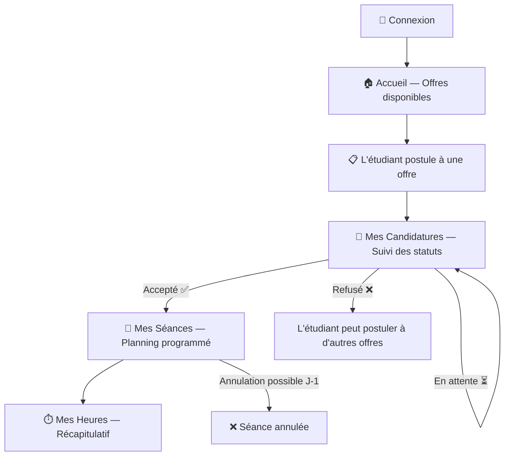

# 🎓 Espace Étudiant — Parcours complet après connexion

## 🔄 Flux complet de l'étudiant



---

## 📌 Sidebar Étudiant (menu de navigation)

```
┌─────────────────────┐
│  🎓 TP Assist       │
│─────────────────────│
│  🏠 Accueil         │  ← Offres disponibles
│  📨 Mes candidatures│  ← Suivi des candidatures
│  📅 Mes séances     │  ← Planning des TP
│  ⏱️ Mes heures      │  ← Récap heures
│─────────────────────│
│  👤 Mon profil      │
│  🚪 Déconnexion     │
└─────────────────────┘
```

---

## 📄 Page 1 — Accueil (Offres disponibles)

> C'est la **première page** que voit l'étudiant après connexion. Elle affiche toutes les offres de matière publiées par les responsables pédagogiques.

### Qu'est-ce qu'une "offre" ?
Le responsable publie une offre quand il cherche un assistant pour une matière. Exemple :
- *"Recherche assistant pour TP de Base de données — L3 Informatique — 4h/semaine"*

### Maquette de la page

```
┌─────────────────────────────────────────────────────────────────┐
│  🏠 Offres d'assistanat disponibles              🔍 Rechercher │
│─────────────────────────────────────────────────────────────────│
│                                                                 │
│  Filtres : [Toutes matières ▼]  [Tous niveaux ▼]  [Ce mois ▼] │
│                                                                 │
│  ┌──────────────────────────────────────────────────────┐       │
│  │  📚 Base de données                                  │       │
│  │  👨‍🏫 Responsable : M. Ettori                         │       │
│  │  🎯 Niveau : L3 Informatique                         │       │
│  │  🕐 Volume : 4h / semaine                            │       │
│  │  📅 Période : Sept 2026 → Déc 2026                   │       │
│  │  📝 Description : Accompagner les étudiants lors     │       │
│  │     des séances de TP SQL et modélisation...          │       │
│  │                                                      │       │
│  │  Compétences requises : SQL, MySQL, Modélisation     │       │
│  │                                                      │       │
│  │         ┌──────────────────────┐                     │       │
│  │         │   ✋ Candidater       │                     │       │
│  │         └──────────────────────┘                     │       │
│  └──────────────────────────────────────────────────────┘       │
│                                                                 │
│  ┌──────────────────────────────────────────────────────┐       │
│  │  📚 Programmation Java                               │       │
│  │  👨‍🏫 Responsable : Mme Durand                        │       │
│  │  🎯 Niveau : L2 Informatique                         │       │
│  │  🕐 Volume : 3h / semaine                            │       │
│  │  📅 Période : Oct 2026 → Jan 2027                    │       │
│  │  📝 Description : Aider les étudiants en TP Java...  │       │
│  │                                                      │       │
│  │  ⚠️ Vous avez déjà candidaté à cette offre           │       │
│  │         ┌──────────────────────┐                     │       │
│  │         │   ✋ Candidater       │  (grisé/désactivé) │       │
│  │         └──────────────────────┘                     │       │
│  └──────────────────────────────────────────────────────┘       │
│                                                                 │
│  ┌──────────────────────────────────────────────────────┐       │
│  │  📚 Réseaux informatiques                            │       │
│  │  👨‍🏫 Responsable : M. Bernard                        │       │
│  │  ...                                                 │       │
│  └──────────────────────────────────────────────────────┘       │
│                                                                 │
└─────────────────────────────────────────────────────────────────┘
```

### Quand l'étudiant clique sur "Candidater" → popup/modal

```
┌────────────────────────────────────────────────┐
│        ✋ Candidater — Base de données          │
│────────────────────────────────────────────────│
│                                                │
│  Pourquoi souhaitez-vous être assistant ?       │
│  ┌──────────────────────────────────────┐      │
│  │ J'ai validé cette matière avec 16/20│      │
│  │ et je souhaite aider les étudiants  │      │
│  │ en difficulté...                    │      │
│  └──────────────────────────────────────┘      │
│                                                │
│  Disponibilités (créneaux préférés)            │
│  ☑ Lundi matin     ☐ Lundi après-midi         │
│  ☐ Mardi matin     ☑ Mardi après-midi         │
│  ☑ Mercredi matin  ☐ Mercredi après-midi      │
│  ...                                           │
│                                                │
│  Note obtenue dans cette matière               │
│  ┌──────────────────────────────────────┐      │
│  │ 16 / 20                             │      │
│  └──────────────────────────────────────┘      │
│                                                │
│    ┌──────────┐    ┌──────────────────┐        │
│    │ Annuler  │    │ Envoyer ✅       │        │
│    └──────────┘    └──────────────────┘        │
└────────────────────────────────────────────────┘
```

---

## 📄 Page 2 — Mes Candidatures

> L'étudiant suit l'état de toutes ses candidatures.

### Maquette

```
┌─────────────────────────────────────────────────────────────────────┐
│  📨 Mes candidatures                                               │
│─────────────────────────────────────────────────────────────────────│
│                                                                     │
│  Filtres : [Tous les statuts ▼]                                    │
│                                                                     │
│  ┌──────────────────────────────────────────────────────────────┐   │
│  │                                                              │   │
│  │  📚 Base de données — M. Ettori                              │   │
│  │  📅 Candidaté le : 15/09/2026                                │   │
│  │  Statut : ✅ ACCEPTÉE                                        │   │
│  │  💬 Commentaire du responsable :                             │   │
│  │     "Profil intéressant, bienvenue dans l'équipe !"         │   │
│  │                                                              │   │
│  └──────────────────────────────────────────────────────────────┘   │
│                                                                     │
│  ┌──────────────────────────────────────────────────────────────┐   │
│  │                                                              │   │
│  │  📚 Programmation Java — Mme Durand                          │   │
│  │  📅 Candidaté le : 18/09/2026                                │   │
│  │  Statut : ⏳ EN ATTENTE                                      │   │
│  │                                                              │   │
│  │  ┌────────────────────────┐                                  │   │
│  │  │  🗑️ Retirer candidature │                                  │   │
│  │  └────────────────────────┘                                  │   │
│  └──────────────────────────────────────────────────────────────┘   │
│                                                                     │
│  ┌──────────────────────────────────────────────────────────────┐   │
│  │                                                              │   │
│  │  📚 Réseaux — M. Bernard                                     │   │
│  │  📅 Candidaté le : 20/09/2026                                │   │
│  │  Statut : ❌ REFUSÉE                                         │   │
│  │  💬 Motif : "Note insuffisante dans cette matière"          │   │
│  │                                                              │   │
│  └──────────────────────────────────────────────────────────────┘   │
│                                                                     │
└─────────────────────────────────────────────────────────────────────┘
```

### Règles

| Règle | Détail |
|-------|--------|
| Retirer une candidature | Possible uniquement si statut = ⏳ En attente |
| Candidature acceptée | Le bouton "Candidater" disparaît de l'offre sur l'accueil |
| Candidature refusée | L'étudiant peut re-candidater (ou pas, à toi de décider) |

---

## 📄 Page 3 — Mes Séances

> Visible seulement si l'étudiant a **au moins une candidature acceptée**. Il voit ici les séances de TP où il est programmé.

### Maquette

```
┌─────────────────────────────────────────────────────────────────────────┐
│  📅 Mes séances programmées                                            │
│─────────────────────────────────────────────────────────────────────────│
│                                                                         │
│  📆 Semaine du 7 au 13 Octobre 2026         [< Précédent] [Suivant >] │
│                                                                         │
│  ┌───────────┬──────────┬──────────┬──────────┬───────────┬──────────┐ │
│  │  Lundi    │  Mardi   │ Mercredi │  Jeudi   │ Vendredi  │  Statut  │ │
│  ├───────────┼──────────┼──────────┼──────────┼───────────┼──────────┤ │
│  │           │ 08h-10h  │          │          │           │          │ │
│  │           │ BDD      │          │          │           │          │ │
│  │           │ Salle B2 │          │          │           │ 🟢 Prévu │ │
│  │           │          │          │          │           │          │ │
│  ├───────────┼──────────┼──────────┼──────────┼───────────┼──────────┤ │
│  │           │          │ 14h-16h  │          │           │          │ │
│  │           │          │ BDD      │          │           │          │ │
│  │           │          │ Salle A1 │          │           │ 🟢 Prévu │ │
│  └───────────┴──────────┴──────────┴──────────┴───────────┴──────────┘ │
│                                                                         │
│                                                                         │
│  📋 Vue liste                                                          │
│  ┌────────────────────────────────────────────────────────────────────┐ │
│  │ Date       │ Horaire   │ Matière │ Salle │ Statut  │ Action      │ │
│  ├────────────┼───────────┼─────────┼───────┼─────────┼─────────────┤ │
│  │ Mar 08/10  │ 08h-10h   │ BDD     │ B2    │ 🟢 Prévu│             │ │
│  │            │           │         │       │         │ ❌ Annuler  │ │
│  ├────────────┼───────────┼─────────┼───────┼─────────┼─────────────┤ │
│  │ Mer 09/10  │ 14h-16h   │ BDD     │ A1    │ 🟢 Prévu│             │ │
│  │            │           │         │       │         │ ❌ Annuler  │ │
│  ├────────────┼───────────┼─────────┼───────┼─────────┼─────────────┤ │
│  │ Mar 15/10  │ 08h-10h   │ BDD     │ B2    │ 🔴 Passé│             │ │
│  │            │           │         │       │(effectué)│ —          │ │
│  └────────────┴───────────┴─────────┴───────┴─────────┴─────────────┘ │
│                                                                         │
└─────────────────────────────────────────────────────────────────────────┘
```

### ⚠️ Règle d'annulation (IMPORTANTE)

```
┌─────────────────────────────────────────────────────────────────┐
│                  RÈGLE D'ANNULATION                             │
│─────────────────────────────────────────────────────────────────│
│                                                                 │
│  📅 Séance prévue le : Mercredi 09/10 à 14h                    │
│                                                                 │
│  ✅ Si aujourd'hui = Lundi 07/10 (J-2)                          │
│     → Bouton "Annuler" VISIBLE et ACTIF                        │
│     → L'étudiant peut annuler                                  │
│                                                                 │
│  ✅ Si aujourd'hui = Mardi 08/10 (J-1)                          │
│     → Bouton "Annuler" VISIBLE et ACTIF                        │
│     → Dernière chance pour annuler !                            │
│                                                                 │
│  ❌ Si aujourd'hui = Mercredi 09/10 (Jour J)                    │
│     → Bouton "Annuler" GRISÉ / MASQUÉ                          │
│     → Message : "Annulation impossible le jour même"           │
│                                                                 │
│  ❌ Si la séance est déjà passée                                │
│     → Pas de bouton du tout                                    │
│                                                                 │
└─────────────────────────────────────────────────────────────────┘
```

### Popup d'annulation

```
┌────────────────────────────────────────────────┐
│  ⚠️ Annuler cette séance ?                     │
│────────────────────────────────────────────────│
│                                                │
│  Séance : BDD — Mer 09/10 — 14h-16h           │
│                                                │
│  Motif d'annulation *                          │
│  ┌──────────────────────────────────────┐      │
│  │ Rendez-vous médical                 │      │
│  └──────────────────────────────────────┘      │
│                                                │
│  ⚠️ Cette action est irréversible.             │
│  Le responsable sera notifié.                  │
│                                                │
│    ┌──────────┐    ┌──────────────────┐        │
│    │ Retour   │    │ Confirmer ❌     │        │
│    └──────────┘    └──────────────────┘        │
└────────────────────────────────────────────────┘
```

---

## 📄 Page 4 — Mes Heures

> Récapitulatif de toutes les heures effectuées avec leur statut de validation.

### Maquette

```
┌──────────────────────────────────────────────────────────────────────┐
│  ⏱️ Mes heures                                     Octobre 2026 ▼  │
│──────────────────────────────────────────────────────────────────────│
│                                                                      │
│  ┌──────────┐  ┌──────────┐  ┌──────────┐  ┌──────────┐            │
│  │  12h     │  │   8h     │  │   2h     │  │   2h     │            │
│  │  Total   │  │ Validées │  │ En att.  │  │ Refusées │            │
│  │  📊      │  │    ✅     │  │    ⏳     │  │    ❌     │            │
│  └──────────┘  └──────────┘  └──────────┘  └──────────┘            │
│                                                                      │
│  ┌────────────────────────────────────────────────────────────────┐  │
│  │ Date       │ Matière │ Horaire  │ Durée │ Statut    │ Détail  │  │
│  ├────────────┼─────────┼──────────┼───────┼───────────┼─────────┤  │
│  │ 01/10/2026 │ BDD     │ 08h-10h  │ 2h    │ ✅ Validée │  👁️    │  │
│  │ 03/10/2026 │ BDD     │ 14h-16h  │ 2h    │ ✅ Validée │  👁️    │  │
│  │ 08/10/2026 │ BDD     │ 08h-10h  │ 2h    │ ✅ Validée │  👁️    │  │
│  │ 10/10/2026 │ BDD     │ 14h-16h  │ 2h    │ ✅ Validée │  👁️    │  │
│  │ 15/10/2026 │ BDD     │ 08h-10h  │ 2h    │ ⏳ Attente │  👁️    │  │
│  │ 17/10/2026 │ BDD     │ 14h-16h  │ 2h    │ ❌ Refusée │  👁️    │  │
│  │            │         │          │       │ Motif:     │         │  │
│  │            │         │          │       │ "Absent"   │         │  │
│  └────────────┴─────────┴──────────┴───────┴───────────┴─────────┘  │
│                                                                      │
│                            [1] [2] [3] →                             │
└──────────────────────────────────────────────────────────────────────┘
```

---

## 📄 Page 5 — Mon Profil

> L'étudiant consulte et modifie ses informations personnelles et **saisit son IBAN** pour le paiement.

### 🔔 Bannière "Profil incomplet"

> Si l'IBAN n'est pas renseigné, un bandeau d'alerte s'affiche sur **toutes les pages** :

```
┌──────────────────────────────────────────────────────────────┐
│  ⚠️ Votre IBAN n'est pas renseigné. Complétez votre profil  │
│     pour recevoir le paiement de vos heures. → Mon profil   │
└──────────────────────────────────────────────────────────────┘
```

### Maquette

```
┌──────────────────────────────────────────────────────────────────────┐
│  👤 Mon profil                                                      │
│──────────────────────────────────────────────────────────────────────│
│                                                                      │
│  ┌──────────────────────────────────────────────────────────────┐    │
│  │  ⚠️ Profil incomplet — Veuillez renseigner votre IBAN       │    │
│  │     pour pouvoir recevoir le paiement de vos heures.        │    │
│  └──────────────────────────────────────────────────────────────┘    │
│                                                                      │
│  ┌──────────────────────────────────────────────────────────────┐    │
│  │  📋 INFORMATIONS PERSONNELLES                    (lecture)   │    │
│  │──────────────────────────────────────────────────────────────│    │
│  │                                                              │    │
│  │  Nom              Prénom            Nº Étudiant              │    │
│  │  ┌────────────┐   ┌────────────┐   ┌────────────┐           │    │
│  │  │ Martin  🔒 │   │ Léa     🔒 │   │ 20230456🔒 │           │    │
│  │  └────────────┘   └────────────┘   └────────────┘           │    │
│  │                                                              │    │
│  │  Email école                       École                     │    │
│  │  ┌─────────────────────────┐       ┌────────────────┐       │    │
│  │  │ lea.martin@escp.eu  🔒 │       │ ESCP        🔒 │       │    │
│  │  └─────────────────────────┘       └────────────────┘       │    │
│  │                                                              │    │
│  │  🔒 = Non modifiable (défini à l'inscription)               │    │
│  └──────────────────────────────────────────────────────────────┘    │
│                                                                      │
│  ┌──────────────────────────────────────────────────────────────┐    │
│  │  ✏️ INFORMATIONS MODIFIABLES                                 │    │
│  │──────────────────────────────────────────────────────────────│    │
│  │                                                              │    │
│  │  Téléphone                  Filière                          │    │
│  │  ┌──────────────────┐       ┌──────────────────┐            │    │
│  │  │ 06 12 34 56 78   │       │ Informatique     │            │    │
│  │  └──────────────────┘       └──────────────────┘            │    │
│  │                                                              │    │
│  │  Année d'études                                              │    │
│  │  ┌──────────────────┐                                       │    │
│  │  │ ▼ L3             │                                       │    │
│  │  └──────────────────┘                                       │    │
│  └──────────────────────────────────────────────────────────────┘    │
│                                                                      │
│  ┌──────────────────────────────────────────────────────────────┐    │
│  │  🏦 INFORMATIONS BANCAIRES (pour le paiement)                │    │
│  │──────────────────────────────────────────────────────────────│    │
│  │                                                              │    │
│  │  Titulaire du compte *                                       │    │
│  │  ┌──────────────────────────────────────────────┐           │    │
│  │  │ Léa Martin                                   │           │    │
│  │  └──────────────────────────────────────────────┘           │    │
│  │                                                              │    │
│  │  IBAN *                                                      │    │
│  │  ┌──────────────────────────────────────────────┐           │    │
│  │  │ FR76 1234 5678 9012 3456 7890 123            │           │    │
│  │  └──────────────────────────────────────────────┘           │    │
│  │  ✅ Format IBAN valide                                       │    │
│  │                                                              │    │
│  │  Code BIC / SWIFT                                            │    │
│  │  ┌──────────────────────────────────────────────┐           │    │
│  │  │ BNPAFRPP                                     │           │    │
│  │  └──────────────────────────────────────────────┘           │    │
│  │                                                              │    │
│  │  🔒 Ces informations sont confidentielles et uniquement     │    │
│  │     transmises au service administratif pour le paiement.   │    │
│  └──────────────────────────────────────────────────────────────┘    │
│                                                                      │
│  ┌──────────────────────────────────────────────────────────────┐    │
│  │  🔑 SÉCURITÉ                                                 │    │
│  │──────────────────────────────────────────────────────────────│    │
│  │                                                              │    │
│  │  Mot de passe actuel        Nouveau mot de passe             │    │
│  │  ┌──────────────────┐       ┌──────────────────┐            │    │
│  │  │ ●●●●●●●●         │       │                  │            │    │
│  │  └──────────────────┘       └──────────────────┘            │    │
│  │                                                              │    │
│  │  Confirmer nouveau mot de passe                              │    │
│  │  ┌──────────────────┐                                       │    │
│  │  │                  │                                       │    │
│  │  └──────────────────┘                                       │    │
│  └──────────────────────────────────────────────────────────────┘    │
│                                                                      │
│              ┌────────────────────────────────┐                      │
│              │   💾 Enregistrer les modifications │                  │
│              └────────────────────────────────┘                      │
│                                                                      │
└──────────────────────────────────────────────────────────────────────┘
```

### Règles de validation

| Champ | Validation |
|-------|-----------|
| **IBAN** | Format FR : `FR` + 25 caractères = 27 au total |
| **BIC** | 8 ou 11 caractères alphanumériques |
| **Titulaire** | Obligatoire si IBAN rempli |

---

## 📊 Résumé des 5 pages étudiantes

| # | Page | Fonction principale | Éléments clés |
|---|------|-------------------|---------------|
| 1 | **Accueil** | Voir les offres & candidater | Cards d'offres + bouton candidater + modal |
| 2 | **Mes candidatures** | Suivre les statuts | Liste avec badges ✅⏳❌ + retirer si en attente |
| 3 | **Mes séances** | Voir le planning | Vue calendrier + vue liste + annulation J-1 |
| 4 | **Mes heures** | Récap des heures | Cartes stats + tableau détaillé par mois |
| 5 | **Mon profil** | Infos perso + IBAN | Infos 🔒 + modifiables + bancaire + mot de passe |
