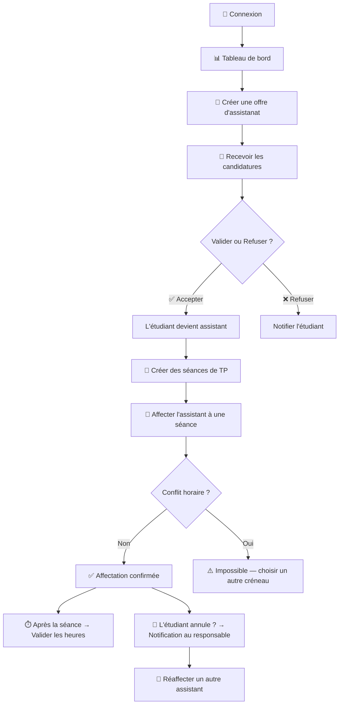

# 👨‍🏫 Espace Responsable Pédagogique — Documentation complète

## 🔄 Flux complet du responsable



---

## 🔔 Système de notifications

> Le responsable doit être **informé en temps réel** quand un étudiant annule une séance. Une cloche de notifications est visible dans le **header** de toutes les pages.

### Header avec notifications

```
┌──────────────────────────────────────────────────────────────────────────┐
│  🎓 TP Assist              🔍 Rechercher        🔔 3   👤 M. Ettori ▼ │
└──────────────────────────────────────────────────────────────────────────┘
                                                    ↑
                                              Badge rouge = 
                                              notifications non lues
```

### Panneau de notifications (au clic sur 🔔)

```
┌────────────────────────────────────────────────┐
│  🔔 Notifications                    Tout lire │
│────────────────────────────────────────────────│
│                                                │
│  🔴 Léa Martin a annulé sa séance             │
│     BDD — Mar 15/10 — 08h-10h                 │
│     Motif : "Rendez-vous médical"              │
│     Il y a 30 min → Réaffecter                 │
│                                                │
│  🔴 Paul Durand a annulé sa séance            │
│     Java — Jeu 17/10 — 10h-12h                │
│     Motif : "Urgence familiale"                │
│     Il y a 2h → Réaffecter                     │
│                                                │
│  🟢 Marie Lopez a candidaté                   │
│     Offre : Réseaux                            │
│     Il y a 5h → Voir                           │
│                                                │
│  ──────────────────────────────────────────    │
│  Voir toutes les notifications                 │
└────────────────────────────────────────────────┘
```

---

## 📌 Sidebar Responsable

```
┌───────────────────────────┐
│  🎓 TP Assist             │
│───────────────────────────│
│  📊 Tableau de bord       │
│  📢 Mes offres            │
│  📨 Candidatures     🔴 2 │  ← badge nb en attente
│  📅 Séances de TP         │
│  👥 Affectations     ⚠️ 3 │  ← badge séances à pourvoir
│  ⏱️ Validation heures 🔴 4│  ← badge heures à valider
│───────────────────────────│
│  👤 Mon profil            │
│  🚪 Déconnexion           │
└───────────────────────────┘
```

> Les **badges rouges** dans la sidebar indiquent au responsable les actions en attente.

---

---

## 📄 Page 1 — Tableau de bord

### 📖 Description
C'est la **page d'accueil** du responsable après connexion. Elle offre une vue d'ensemble de toute son activité : offres, candidatures, séances, heures, et surtout les **alertes** (annulations d'étudiants, séances sans assistant).

### ⚙️ Comportement
- Les **cartes statistiques** se mettent à jour automatiquement.
- Le bloc **"🚨 Alertes"** affiche les annulations récentes des étudiants avec le **motif** et un lien direct pour réaffecter.
- Le bloc **"Séances à venir"** signale les séances **sans assistant** en rouge.
- Le bloc **"Candidatures récentes"** montre les 5 dernières candidatures avec un lien pour les traiter.

### 📝 Guide d'utilisation
1. **Consultez les alertes en premier** → si un étudiant a annulé, cliquez "Réaffecter" pour trouver un remplaçant.
2. **Vérifiez les séances à venir** → une séance en 🔴 n'a pas d'assistant, cliquez dessus pour en affecter un.
3. **Traitez les candidatures en attente** → cliquez "Voir" pour accéder à la page candidatures.
4. **Suivez la progression des heures** → la barre de progression montre le taux de validation du mois.

### Maquette

```
┌──────────────────────────────────────────────────────────────────────────┐
│  📊 Tableau de bord                          Bonjour, M. Ettori 👋     │
│──────────────────────────────────────────────────────────────────────────│
│                                                                          │
│  ┌────────────┐  ┌────────────┐  ┌────────────┐  ┌────────────┐        │
│  │     3      │  │     7      │  │     5      │  │    24h     │        │
│  │  Offres    │  │ Candidat.  │  │ Assistants │  │  Heures à  │        │
│  │  actives   │  │ en attente │  │  actifs    │  │  valider   │        │
│  │    📢      │  │    📨 🔴   │  │    👥      │  │   ⏱️ 🔴    │        │
│  └────────────┘  └────────────┘  └────────────┘  └────────────┘        │
│                                                                          │
│  ┌──────────────────────────────────────────────────────────────────┐   │
│  │  🚨 ALERTES — Actions requises                                   │   │
│  │──────────────────────────────────────────────────────────────────│   │
│  │                                                                  │   │
│  │  🔴 Léa Martin a ANNULÉ sa séance                               │   │
│  │     BDD — Mar 15/10 — 08h-10h · Salle B2                       │   │
│  │     📝 Motif : "Rendez-vous médical"                            │   │
│  │     ⏰ Annulé il y a 30 min                                     │   │
│  │     → [👥 Réaffecter un assistant]  [👁️ Voir la séance]         │   │
│  │                                                                  │   │
│  │  🔴 Paul Durand a ANNULÉ sa séance                              │   │
│  │     Java — Jeu 17/10 — 10h-12h · Salle C3                      │   │
│  │     📝 Motif : "Urgence familiale"                              │   │
│  │     ⏰ Annulé il y a 2h                                         │   │
│  │     → [👥 Réaffecter un assistant]  [👁️ Voir la séance]         │   │
│  │                                                                  │   │
│  │  ⚠️ Séance sans assistant                                       │   │
│  │     Réseaux — Ven 18/10 — 14h-16h · Salle D2                   │   │
│  │     → [👥 Affecter un assistant]                                 │   │
│  │                                                                  │   │
│  └──────────────────────────────────────────────────────────────────┘   │
│                                                                          │
│  ┌─────────────────────────────────┬────────────────────────────────┐   │
│  │  📅 Séances à venir (7 jours)  │  📨 Dernières candidatures     │   │
│  │─────────────────────────────────│────────────────────────────────│   │
│  │                                 │                                │   │
│  │  Mar 08/10 — 08h-10h           │  Léa Martin — BDD             │   │
│  │  BDD · Salle B2                │  ⏳ Il y a 2h → Voir          │   │
│  │  👤 Léa Martin  🟢             │                                │   │
│  │                                 │  Paul Durand — BDD            │   │
│  │  Mer 09/10 — 14h-16h           │  ⏳ Il y a 5h → Voir          │   │
│  │  BDD · Salle A1                │                                │   │
│  │  👤 Léa Martin  🟢             │  Marie Lopez — Java           │   │
│  │                                 │  ⏳ Hier → Voir               │   │
│  │  🔴 Mar 15/10 — 08h-10h        │                                │   │
│  │  BDD · Salle B2                │                                │   │
│  │  ⚠️ ANNULÉ par Léa Martin      │                                │   │
│  │                                 │                                │   │
│  └─────────────────────────────────┴────────────────────────────────┘   │
│                                                                          │
│  ┌──────────────────────────────────────────────────────────────────┐   │
│  │  📈 Heures du mois — Octobre 2026                               │   │
│  │  ██████████████████████░░░░░░  36h / 48h validées (75%)         │   │
│  │  ✅ 36h validées   ⏳ 8h en attente   ❌ 4h refusées             │   │
│  └──────────────────────────────────────────────────────────────────┘   │
│                                                                          │
└──────────────────────────────────────────────────────────────────────────┘
```

---

---

## 📄 Page 2 — Mes Offres

### 📖 Description
C'est ici que le responsable **crée et gère ses offres d'assistanat**. Chaque offre correspond à une matière pour laquelle il recherche un ou plusieurs assistants. Les offres apparaissent ensuite sur la page d'accueil des étudiants.

### ⚙️ Comportement
- Une offre peut être **Active** (visible par les étudiants) ou **Clôturée** (invisible).
- Quand une offre est créée, elle apparaît immédiatement dans l'accueil des étudiants de la même école.
- Le compteur de candidatures se met à jour en temps réel.
- **Modifier** une offre ne supprime pas les candidatures existantes.
- **Désactiver** une offre empêche les nouvelles candidatures mais conserve celles déjà reçues.
- **Supprimer** une offre n'est possible que si aucune candidature n'a été acceptée (sinon il faut d'abord la clôturer).

### 📝 Guide d'utilisation
1. Cliquez **"+ Créer une offre"** → remplissez le formulaire (matière, niveau, description, compétences, dates).
2. L'offre est publiée → les étudiants la voient et peuvent candidater.
3. Consultez le compteur de candidatures sur chaque carte d'offre.
4. Cliquez **"📨 Candid."** pour accéder directement aux candidatures de cette offre.
5. Quand vous avez assez d'assistants, cliquez **"🔴 Désactiver"** pour fermer les candidatures.

### Maquette — Liste des offres

```
┌──────────────────────────────────────────────────────────────────────────┐
│  📢 Mes offres d'assistanat                    ┌──────────────────────┐ │
│                                                 │  + Créer une offre   │ │
│                                                 └──────────────────────┘ │
│──────────────────────────────────────────────────────────────────────────│
│                                                                          │
│  Filtres : [Toutes ▼]  [Actives ▼]                                      │
│                                                                          │
│  ┌──────────────────────────────────────────────────────────────────┐   │
│  │  📚 Base de données                           🟢 Active         │   │
│  │  🎯 L3 Informatique · 4h/sem                                    │   │
│  │  📅 Sept 2026 → Déc 2026                                        │   │
│  │  👥 Candidatures : 7 reçues · 3 acceptées · 2 en attente        │   │
│  │                                                                  │   │
│  │  ┌──────────┐  ┌──────────┐  ┌──────────┐  ┌──────────────┐    │   │
│  │  │ ✏️ Modif. │  │ 👁️ Voir  │  │ 📨 Candid│  │ 🔴 Désactiver│    │   │
│  │  └──────────┘  └──────────┘  └──────────┘  └──────────────┘    │   │
│  └──────────────────────────────────────────────────────────────────┘   │
│                                                                          │
│  ┌──────────────────────────────────────────────────────────────────┐   │
│  │  📚 Programmation Java                        🔴 Clôturée       │   │
│  │  🎯 L2 Informatique · 3h/sem                                    │   │
│  │  📅 Oct 2026 → Jan 2027                                         │   │
│  │  👥 Candidatures : 4 reçues · 2 acceptées                       │   │
│  │                                                                  │   │
│  │  ┌──────────┐  ┌──────────┐  ┌──────────────┐                  │   │
│  │  │ ✏️ Modif. │  │ 👁️ Voir  │  │ 🟢 Réactiver │                  │   │
│  │  └──────────┘  └──────────┘  └──────────────┘                  │   │
│  └──────────────────────────────────────────────────────────────────┘   │
│                                                                          │
└──────────────────────────────────────────────────────────────────────────┘
```

### Modal — Créer / Modifier une offre

```
┌───────────────────────────────────────────────────────────┐
│  📢 Créer une offre d'assistanat                          │
│───────────────────────────────────────────────────────────│
│                                                           │
│  Matière *                                                │
│  ┌─────────────────────────────────────────┐              │
│  │ Base de données                         │              │
│  └─────────────────────────────────────────┘              │
│                                                           │
│  Niveau / Filière *           Volume horaire *            │
│  ┌──────────────────┐         ┌──────────────────┐       │
│  │ ▼ L3 Informatique│         │ 4h / semaine     │       │
│  └──────────────────┘         └──────────────────┘       │
│                                                           │
│  Date début *                 Date fin *                  │
│  ┌──────────────────┐         ┌──────────────────┐       │
│  │ 📅 01/09/2026    │         │ 📅 20/12/2026    │       │
│  └──────────────────┘         └──────────────────┘       │
│                                                           │
│  Description du poste *                                   │
│  ┌─────────────────────────────────────────┐              │
│  │ Accompagner les étudiants de L3 lors   │              │
│  │ des séances de TP portant sur le SQL,  │              │
│  │ la modélisation et la normalisation... │              │
│  └─────────────────────────────────────────┘              │
│                                                           │
│  Compétences requises                                     │
│  ┌─────────────────────────────────────────┐              │
│  │ SQL, MySQL, Modélisation, Merise       │              │
│  └─────────────────────────────────────────┘              │
│                                                           │
│  Note minimum requise (optionnel)                         │
│  ┌──────────────────┐                                    │
│  │ 12 / 20          │                                    │
│  └──────────────────┘                                    │
│                                                           │
│    ┌──────────┐    ┌──────────────────┐                   │
│    │ Annuler  │    │ Publier l'offre ✅│                   │
│    └──────────┘    └──────────────────┘                   │
└───────────────────────────────────────────────────────────┘
```

---

---

## 📄 Page 3 — Candidatures reçues

### 📖 Description
Le responsable consulte toutes les candidatures reçues pour ses offres. Il peut voir le détail de chaque candidat (motivation, note, disponibilités) et **accepter** ou **refuser** avec un motif.

### ⚙️ Comportement
- Les candidatures sont **triées par date** (les plus récentes en haut).
- Le filtre **"⏳ En attente"** est activé par défaut pour montrer les candidatures à traiter en priorité.
- Quand le responsable **accepte** → l'étudiant reçoit une notification et devient disponible pour l'affectation aux séances.
- Quand le responsable **refuse** → il doit choisir un motif. L'étudiant voit le motif dans sa page "Mes candidatures".
- Une candidature déjà traitée (acceptée/refusée) ne peut pas être re-modifiée.

### 📝 Guide d'utilisation
1. Arrivez sur la page → les candidatures **en attente** s'affichent en premier.
2. Lisez la motivation, la note obtenue et les disponibilités du candidat.
3. Cliquez **"✅ Accepter"** → confirmation immédiate, l'étudiant est notifié.
4. Cliquez **"❌ Refuser"** → une popup s'ouvre pour choisir le motif du refus.
5. Utilisez le filtre par offre pour voir les candidatures d'une matière spécifique.
6. Les candidatures traitées passent en bas de page avec leur statut affiché.

### Maquette

```
┌──────────────────────────────────────────────────────────────────────────┐
│  📨 Candidatures reçues                                                 │
│──────────────────────────────────────────────────────────────────────────│
│                                                                          │
│  Filtres : [Toutes les offres ▼]  [⏳ En attente ▼]                     │
│                                                                          │
│  ┌──────────────────────────────────────────────────────────────────┐   │
│  │                                                                  │   │
│  │  👤 Léa Martin                                    ⏳ EN ATTENTE  │   │
│  │  📚 Offre : Base de données                                      │   │
│  │  🔢 Nº étudiant : 20230456                                       │   │
│  │  🎓 L3 Informatique                                              │   │
│  │  📅 Candidaté le : 15/09/2026                                    │   │
│  │  📝 Motivation : "J'ai validé cette matière avec 16/20..."      │   │
│  │  📊 Note obtenue : 16/20                                         │   │
│  │  🕐 Disponibilités : Lun matin, Mar AM, Mer matin               │   │
│  │                                                                  │   │
│  │  ┌──────────────────┐  ┌──────────────────┐                     │   │
│  │  │  ✅ Accepter      │  │  ❌ Refuser       │                     │   │
│  │  └──────────────────┘  └──────────────────┘                     │   │
│  └──────────────────────────────────────────────────────────────────┘   │
│                                                                          │
│  ┌──────────────────────────────────────────────────────────────────┐   │
│  │                                                                  │   │
│  │  👤 Paul Durand                                   ⏳ EN ATTENTE  │   │
│  │  📚 Offre : Base de données                                      │   │
│  │  🔢 Nº étudiant : 20230789                                       │   │
│  │  🎓 M1 Informatique                                              │   │
│  │  📅 Candidaté le : 16/09/2026                                    │   │
│  │  📝 Motivation : "Ancien tuteur en BDD, expérience de 2 ans"   │   │
│  │  📊 Note obtenue : 18/20                                         │   │
│  │  🕐 Disponibilités : Mar matin, Jeu AM                          │   │
│  │                                                                  │   │
│  │  ┌──────────────────┐  ┌──────────────────┐                     │   │
│  │  │  ✅ Accepter      │  │  ❌ Refuser       │                     │   │
│  │  └──────────────────┘  └──────────────────┘                     │   │
│  └──────────────────────────────────────────────────────────────────┘   │
│                                                                          │
└──────────────────────────────────────────────────────────────────────────┘
```

### Modal — Refuser une candidature

```
┌────────────────────────────────────────────────┐
│  ❌ Refuser la candidature                     │
│────────────────────────────────────────────────│
│                                                │
│  Candidat : Paul Durand                        │
│  Offre : Base de données                       │
│                                                │
│  Motif du refus *                              │
│  ┌──────────────────────────────────────┐      │
│  │ ▼ Sélectionnez un motif             │      │
│  │   ● Note insuffisante              │      │
│  │   ● Pas de disponibilité commune   │      │
│  │   ● Poste déjà pourvu              │      │
│  │   ● Autre (préciser)               │      │
│  └──────────────────────────────────────┘      │
│                                                │
│  Commentaire (optionnel)                       │
│  ┌──────────────────────────────────────┐      │
│  │                                      │      │
│  └──────────────────────────────────────┘      │
│                                                │
│  ⚠️ L'étudiant sera notifié du refus.          │
│                                                │
│    ┌──────────┐    ┌──────────────────┐        │
│    │ Annuler  │    │ Confirmer ❌     │        │
│    └──────────┘    └──────────────────┘        │
└────────────────────────────────────────────────┘
```

---

---

## 📄 Page 4 — Séances de TP

### 📖 Description
Le responsable **crée, modifie et supprime** les séances de TP. Chaque séance a une date, un créneau horaire, une salle et éventuellement un assistant affecté. C'est aussi ici qu'il voit les **séances annulées par un étudiant**.

### ⚙️ Comportement
- Deux vues disponibles : **calendrier** (vue semaine/mois) et **liste** (tableau).
- Les séances sont colorées selon leur statut :
  - 🟢 **Vert** = assistant affecté, tout va bien
  - 🔴 **Rouge** = pas d'assistant affecté
  - 🟠 **Orange** = assistant a annulé, séance à réaffecter
- La **récurrence** permet de créer automatiquement une séance qui se répète (chaque semaine, toutes les 2 semaines).
- **Supprimer** une séance future est possible. Supprimer une séance passée est interdit.
- Quand un **étudiant annule** une séance, elle passe en 🟠 orange avec le motif affiché, et le responsable reçoit une notification.

### 📝 Guide d'utilisation
1. Cliquez **"+ Créer une séance"** → choisissez la matière, la date, l'horaire, la salle.
2. Optionnel : affectez directement un assistant lors de la création (le système montre qui est disponible 🟢 et qui a un conflit 🔴).
3. Utilisez la **récurrence** pour éviter de recréer la même séance chaque semaine.
4. En vue calendrier, cliquez sur une séance pour la modifier ou voir les détails.
5. Si une séance est en 🟠 → l'étudiant a annulé. Cliquez pour **réaffecter** un autre assistant.
6. Utilisez les filtres pour voir uniquement une matière ou les séances problématiques.

### Maquette — Vue calendrier + liste

```
┌──────────────────────────────────────────────────────────────────────────┐
│  📅 Séances de TP                              ┌──────────────────────┐ │
│                                                 │  + Créer une séance  │ │
│                                                 └──────────────────────┘ │
│──────────────────────────────────────────────────────────────────────────│
│                                                                          │
│  Vue : [📅 Calendrier] [📋 Liste]        Mois : [◀ Oct 2026 ▶]        │
│  Filtres : [Toutes matières ▼] [Tous statuts ▼]                        │
│                                                                          │
│  ┌──────────┬──────────┬──────────┬──────────┬──────────┐              │
│  │  Lundi   │  Mardi   │ Mercredi │  Jeudi   │ Vendredi │              │
│  ├──────────┼──────────┼──────────┼──────────┼──────────┤              │
│  │          │ ┌──────┐ │          │          │          │              │
│  │          │ │08-10h│ │          │          │          │              │
│  │          │ │BDD   │ │          │          │          │              │
│  │          │ │👤 Léa │ │          │          │          │              │
│  │          │ │🟢     │ │          │          │          │              │
│  │          │ └──────┘ │          │          │          │              │
│  │          │          │ ┌──────┐ │          │          │              │
│  │          │          │ │14-16h│ │          │          │              │
│  │          │          │ │BDD   │ │          │          │              │
│  │          │          │ │👤 Léa │ │          │          │              │
│  │          │          │ │🟢     │ │          │          │              │
│  │          │          │ └──────┘ │          │          │              │
│  │          │ ┌──────┐ │          │ ┌──────┐ │          │              │
│  │          │ │08-10h│ │          │ │10-12h│ │          │              │
│  │          │ │BDD   │ │          │ │Java  │ │          │              │
│  │          │ │🟠 ANN│ │          │ │⚠️ --- │ │          │              │
│  │          │ │Léa M.│ │          │ │🔴     │ │          │              │
│  │          │ └──────┘ │          │ └──────┘ │          │              │
│  └──────────┴──────────┴──────────┴──────────┴──────────┘              │
│                                                                          │
│  🟢 = OK    🔴 = Pas d'assistant    🟠 = Annulé par l'étudiant         │
│                                                                          │
│  📋 Vue liste                                                           │
│  ┌───────────┬─────────┬─────────┬───────┬───────────┬────────┬──────┐ │
│  │ Date      │ Horaire │ Matière │ Salle │ Assistant  │ Statut │ Act. │ │
│  ├───────────┼─────────┼─────────┼───────┼───────────┼────────┼──────┤ │
│  │ Mar 08/10 │ 08h-10h │ BDD     │ B2    │ Léa M.    │ 🟢     │ ✏️🗑️ │ │
│  │ Mer 09/10 │ 14h-16h │ BDD     │ A1    │ Léa M.    │ 🟢     │ ✏️🗑️ │ │
│  │ Mar 15/10 │ 08h-10h │ BDD     │ B2    │ Léa M.    │ 🟠 ANN │ 👥   │ │
│  │           │         │         │       │ Motif:     │        │      │ │
│  │           │         │         │       │ "RDV méd." │        │      │ │
│  │ Jeu 10/10 │ 10h-12h │ Java    │ C3    │ ⚠️ Aucun   │ 🔴     │ 👥   │ │
│  └───────────┴─────────┴─────────┴───────┴───────────┴────────┴──────┘ │
│                                                                          │
│            👥 = Affecter/Réaffecter    🟠 ANN = Annulé par étudiant     │
│                                                                          │
└──────────────────────────────────────────────────────────────────────────┘
```

### Modal — Créer / Modifier une séance

```
┌───────────────────────────────────────────────────────────┐
│  📅 Créer une séance de TP                                │
│───────────────────────────────────────────────────────────│
│                                                           │
│  Offre / Matière *                                        │
│  ┌─────────────────────────────────────────┐              │
│  │ ▼ Base de données                       │              │
│  └─────────────────────────────────────────┘              │
│                                                           │
│  Date *                       Salle *                     │
│  ┌──────────────────┐         ┌──────────────────┐       │
│  │ 📅 08/10/2026    │         │ Salle B2         │       │
│  └──────────────────┘         └──────────────────┘       │
│                                                           │
│  Heure début *                Heure fin *                 │
│  ┌──────────────────┐         ┌──────────────────┐       │
│  │ 🕐 08:00         │         │ 🕐 10:00         │       │
│  └──────────────────┘         └──────────────────┘       │
│                                                           │
│  Récurrence                                               │
│  ┌─────────────────────────────────────────┐              │
│  │ ▼ Chaque semaine (jusqu'à fin offre)    │              │
│  │   ● Séance unique                      │              │
│  │   ● Chaque semaine                     │              │
│  │   ● Toutes les 2 semaines              │              │
│  └─────────────────────────────────────────┘              │
│                                                           │
│  Affecter un assistant maintenant ?                       │
│  ┌─────────────────────────────────────────┐              │
│  │ ▼ Léa Martin (disponible)              │              │
│  │   ● Léa Martin (disponible)  🟢       │              │
│  │   ● Paul Durand (conflit)    🔴       │              │
│  │   ● Affecter plus tard                 │              │
│  └─────────────────────────────────────────┘              │
│                                                           │
│  Notes / commentaires                                     │
│  ┌─────────────────────────────────────────┐              │
│  │ TP sur les jointures SQL               │              │
│  └─────────────────────────────────────────┘              │
│                                                           │
│    ┌──────────┐    ┌──────────────────┐                   │
│    │ Annuler  │    │ Créer la séance ✅│                   │
│    └──────────┘    └──────────────────┘                   │
└───────────────────────────────────────────────────────────┘
```

---

---

## 📄 Page 5 — Affectations

### 📖 Description
Page dédiée à l'**affectation et la réaffectation** des assistants aux séances. Le responsable y voit clairement quelles séances n'ont pas d'assistant et lesquelles ont été annulées par un étudiant.

### ⚙️ Comportement
- La page est divisée en **3 sections** classées par priorité :
  1. 🟠 **Séances annulées** (l'étudiant a annulé) → priorité maximale, le motif est affiché
  2. 🔴 **Séances sans assistant** → à pourvoir
  3. 🟢 **Séances avec assistant** → tout va bien, possibilité de changer l'assistant
- Quand on clique **"👥 Réaffecter"**, une modal s'ouvre avec la liste des assistants disponibles. Le système vérifie automatiquement les **conflits horaires** et affiche :
  - 🟢 Disponible → bouton actif
  - 🔴 Conflit → bouton grisé avec explication du conflit
- **Après réaffectation**, la séance repasse en 🟢 et l'alerte disparaît du tableau de bord.

### 📝 Guide d'utilisation
1. Consultez d'abord la section **"🟠 Annulées par l'étudiant"** → ce sont les urgences.
2. Cliquez **"👥 Réaffecter"** → choisissez un assistant disponible (🟢).
3. Si personne n'est disponible, vous pouvez **modifier la séance** (changer l'horaire) ou la **supprimer**.
4. Consultez ensuite les **séances sans assistant** (🔴) et affectez-en un.
5. Dans la section **"🟢 Tout va bien"**, vous pouvez changer un assistant si besoin (bouton 🔄).

### Maquette

```
┌──────────────────────────────────────────────────────────────────────────┐
│  👥 Affectations des assistants                                         │
│──────────────────────────────────────────────────────────────────────────│
│                                                                          │
│  ┌─────────────────────────────────────────────────────────────────┐    │
│  │  🟠 Séances ANNULÉES par l'étudiant (à réaffecter en urgence)  │    │
│  │─────────────────────────────────────────────────────────────────│    │
│  │                                                                 │    │
│  │  ┌───────────┬─────────┬─────────┬───────┬──────────┬────────┐ │    │
│  │  │ Date      │ Horaire │ Matière │ Salle │ Ancien   │ Action │ │    │
│  │  ├───────────┼─────────┼─────────┼───────┼──────────┼────────┤ │    │
│  │  │ Mar 15/10 │ 08h-10h │ BDD     │ B2    │ Léa M.   │        │ │    │
│  │  │           │         │         │       │ Motif:   │ 👥     │ │    │
│  │  │           │         │         │       │ "RDV     │Réaff.  │ │    │
│  │  │           │         │         │       │  médical"│        │ │    │
│  │  ├───────────┼─────────┼─────────┼───────┼──────────┼────────┤ │    │
│  │  │ Jeu 17/10 │ 10h-12h │ Java    │ C3    │ Paul D.  │        │ │    │
│  │  │           │         │         │       │ Motif:   │ 👥     │ │    │
│  │  │           │         │         │       │ "Urgence │Réaff.  │ │    │
│  │  │           │         │         │       │ famille" │        │ │    │
│  │  └───────────┴─────────┴─────────┴───────┴──────────┴────────┘ │    │
│  └─────────────────────────────────────────────────────────────────┘    │
│                                                                          │
│  ┌─────────────────────────────────────────────────────────────────┐    │
│  │  🔴 Séances sans assistant (à pourvoir)                         │    │
│  │─────────────────────────────────────────────────────────────────│    │
│  │                                                                 │    │
│  │  ┌───────────┬─────────┬─────────┬───────┬─────────────────┐   │    │
│  │  │ Date      │ Horaire │ Matière │ Salle │ Action          │   │    │
│  │  ├───────────┼─────────┼─────────┼───────┼─────────────────┤   │    │
│  │  │ Ven 18/10 │ 14h-16h │ Réseaux │ D2    │ 👥 Affecter     │   │    │
│  │  │ Mar 22/10 │ 08h-10h │ BDD     │ B2    │ 👥 Affecter     │   │    │
│  │  └───────────┴─────────┴─────────┴───────┴─────────────────┘   │    │
│  └─────────────────────────────────────────────────────────────────┘    │
│                                                                          │
│  ┌─────────────────────────────────────────────────────────────────┐    │
│  │  🟢 Séances avec assistant (tout va bien)                       │    │
│  │─────────────────────────────────────────────────────────────────│    │
│  │                                                                 │    │
│  │  ┌───────────┬─────────┬─────────┬───────┬───────────┬──────┐  │    │
│  │  │ Date      │ Horaire │ Matière │ Salle │ Assistant  │ Act. │  │    │
│  │  ├───────────┼─────────┼─────────┼───────┼───────────┼──────┤  │    │
│  │  │ Mar 08/10 │ 08h-10h │ BDD     │ B2    │ Léa M.    │ 🔄   │  │    │
│  │  │ Mer 09/10 │ 14h-16h │ BDD     │ A1    │ Léa M.    │ 🔄   │  │    │
│  │  │ Mar 15/10 │ 08h-10h │ BDD     │ B2    │ Paul D.   │ 🔄   │  │    │
│  │  └───────────┴─────────┴─────────┴───────┴───────────┴──────┘  │    │
│  │                                                                 │    │
│  │  🔄 = Changer l'assistant                                       │    │
│  └─────────────────────────────────────────────────────────────────┘    │
│                                                                          │
└──────────────────────────────────────────────────────────────────────────┘
```

### Modal — Affecter / Réaffecter un assistant

```
┌───────────────────────────────────────────────────────────────┐
│  👥 Réaffecter un assistant                                   │
│───────────────────────────────────────────────────────────────│
│                                                               │
│  Séance : BDD — Mar 15/10 — 08h-10h — Salle B2              │
│  🟠 Annulé par : Léa Martin                                  │
│  📝 Motif : "Rendez-vous médical"                            │
│                                                               │
│  Assistants acceptés disponibles :                            │
│                                                               │
│  ┌───────────────────────────────────────────────────────┐   │
│  │                                                       │   │
│  │  🟢 Marie Lopez — L3 Info                             │   │
│  │     Dispo : Mar, Jeu, Ven ✅                          │   │
│  │     Heures ce mois : 4h / 20h max                    │   │
│  │                     ┌──────────────┐                  │   │
│  │                     │ Affecter ✅   │                  │   │
│  │                     └──────────────┘                  │   │
│  │                                                       │   │
│  │  🔴 Paul Durand — M1 Info                             │   │
│  │     ⚠️ CONFLIT : déjà affecté Mar 15/10 08h-10h       │   │
│  │     (Séance Réseaux — Salle D1)                      │   │
│  │                     ┌──────────────┐                  │   │
│  │                     │ Affecter     │ (grisé)         │   │
│  │                     └──────────────┘                  │   │
│  │                                                       │   │
│  └───────────────────────────────────────────────────────┘   │
│                                                               │
│    ┌──────────┐                                               │
│    │ Fermer   │                                               │
│    └──────────┘                                               │
└───────────────────────────────────────────────────────────────┘
```

### ⚠️ Règles de conflits horaires

```
┌─────────────────────────────────────────────────────────────────┐
│                RÈGLE DE CONFLIT HORAIRE                          │
│─────────────────────────────────────────────────────────────────│
│                                                                 │
│  Un assistant ne peut PAS être affecté à 2 séances qui          │
│  se chevauchent :                                               │
│                                                                 │
│  ❌ Jeu 10/10 10h-12h (BDD) + Jeu 10/10 10h-12h (Java)        │
│  ❌ Jeu 10/10 10h-12h (BDD) + Jeu 10/10 11h-13h (Java)        │
│  ✅ Jeu 10/10 08h-10h (BDD) + Jeu 10/10 10h-12h (Java)        │
│  ✅ Jeu 10/10 10h-12h (BDD) + Ven 11/10 10h-12h (Java)        │
│                                                                 │
│  → Le bouton "Affecter" est GRISÉ + message d'explication      │
│                                                                 │
└─────────────────────────────────────────────────────────────────┘
```

---

---

## 📄 Page 6 — Validation des heures

### 📖 Description
Après chaque séance de TP, le responsable doit **valider ou refuser** les heures de l'assistant. C'est ce qui détermine si l'assistant sera payé ou non. Les heures annulées par l'étudiant apparaissent aussi ici avec un statut spécifique.

### ⚙️ Comportement
- Les heures **en attente** sont affichées en priorité en haut de page.
- Le responsable peut **valider/refuser individuellement** (boutons ✅/❌ sur chaque ligne) ou **en lot** (cases à cocher + boutons d'action groupée).
- Quand une heure est **refusée**, une popup demande le motif (Absent, En retard, Prestation insuffisante, Autre).
- Les heures dont la séance a été **annulée par l'étudiant** sont marquées automatiquement comme **"🟠 Annulée"** et ne comptent pas dans le total. Le responsable n'a pas besoin de les traiter.
- Le filtre par mois permet de voir l'historique des validations.
- Un **compteur** en haut résume les heures du mois.

### 📝 Guide d'utilisation
1. Consultez les heures **⏳ En attente** en haut de page.
2. **Validation rapide** : cliquez ✅ directement sur la ligne pour valider une heure.
3. **Validation en lot** : cochez plusieurs lignes → cliquez "✅ Valider la sélection".
4. **Refuser** : cliquez ❌ → choisissez un motif dans la popup.
5. Les heures 🟠 annulées par l'étudiant sont affichées pour info mais ne nécessitent aucune action.
6. Changez le mois avec le filtre pour consulter l'historique.

### Maquette

```
┌──────────────────────────────────────────────────────────────────────────┐
│  ⏱️ Validation des heures                                               │
│──────────────────────────────────────────────────────────────────────────│
│                                                                          │
│  Filtres : [Toutes matières ▼]  [⏳ En attente ▼]  [Oct 2026 ▼]       │
│                                                                          │
│  ┌────────────┐  ┌────────────┐  ┌────────────┐  ┌────────────┐        │
│  │   48h      │  │   36h      │  │    8h      │  │    4h      │        │
│  │   Total    │  │  Validées  │  │  En att.   │  │  Refusées  │        │
│  │    📊      │  │    ✅       │  │    ⏳       │  │    ❌       │        │
│  └────────────┘  └────────────┘  └────────────┘  └────────────┘        │
│                                                                          │
│  ┌───────────────────────────────────────────────────────────────────┐  │
│  │  ⏳ Heures en attente de validation                               │  │
│  │                                                                   │  │
│  │  ☐  │ Date      │ Matière │ Horaire │ Assistant │ Durée │ Action │  │
│  │  ├──┼───────────┼─────────┼─────────┼──────────┼───────┼────────│  │
│  │  ☐  │ 15/10/26  │ BDD     │ 08-10h  │ Léa M.   │ 2h    │ ✅ ❌  │  │
│  │  ☐  │ 17/10/26  │ BDD     │ 14-16h  │ Léa M.   │ 2h    │ ✅ ❌  │  │
│  │  ☐  │ 17/10/26  │ Java    │ 10-12h  │ Marie L. │ 2h    │ ✅ ❌  │  │
│  │  ☐  │ 22/10/26  │ BDD     │ 08-10h  │ Paul D.  │ 2h    │ ✅ ❌  │  │
│  │                                                                   │  │
│  │  ☑ Tout sélectionner                                              │  │
│  │  ┌──────────────────────────┐  ┌───────────────────────────┐     │  │
│  │  │ ✅ Valider la sélection  │  │ ❌ Refuser la sélection   │     │  │
│  │  └──────────────────────────┘  └───────────────────────────┘     │  │
│  └───────────────────────────────────────────────────────────────────┘  │
│                                                                          │
│  ┌───────────────────────────────────────────────────────────────────┐  │
│  │  🟠 Séances annulées par l'étudiant (aucune action requise)      │  │
│  │                                                                   │  │
│  │  │ Date      │ Matière │ Horaire │ Assistant │ Motif annulation │  │
│  │  ├───────────┼─────────┼─────────┼──────────┼──────────────────│  │
│  │  │ 15/10/26  │ BDD     │ 08-10h  │ Léa M.   │ "RDV médical"   │  │
│  │  │ 17/10/26  │ Java    │ 10-12h  │ Paul D.  │ "Urgence famille"│  │
│  │                                                                   │  │
│  └───────────────────────────────────────────────────────────────────┘  │
│                                                                          │
│  ┌───────────────────────────────────────────────────────────────────┐  │
│  │  ✅ Heures déjà traitées ce mois                                  │  │
│  │                                                                   │  │
│  │  │ Date      │ Matière │ Horaire │ Assistant │ Durée │ Statut   │  │
│  │  ├───────────┼─────────┼─────────┼──────────┼───────┼──────────│  │
│  │  │ 01/10/26  │ BDD     │ 08-10h  │ Léa M.   │ 2h    │ ✅       │  │
│  │  │ 03/10/26  │ BDD     │ 14-16h  │ Léa M.   │ 2h    │ ✅       │  │
│  │  │ 08/10/26  │ BDD     │ 08-10h  │ Léa M.   │ 2h    │ ❌ Absent│  │
│  │  │ 10/10/26  │ Java    │ 10-12h  │ Marie L. │ 2h    │ ✅       │  │
│  │                                                                   │  │
│  └───────────────────────────────────────────────────────────────────┘  │
│                                                                          │
└──────────────────────────────────────────────────────────────────────────┘
```

### Modal — Refuser des heures

```
┌────────────────────────────────────────────────┐
│  ❌ Refuser les heures                         │
│────────────────────────────────────────────────│
│                                                │
│  Assistant : Léa Martin                        │
│  Séance : BDD — 08/10/26 — 08h-10h            │
│                                                │
│  Motif du refus *                              │
│  ┌──────────────────────────────────────┐      │
│  │ ▼ Sélectionnez un motif             │      │
│  │   ● Absent(e)                       │      │
│  │   ● En retard (> 15 min)           │      │
│  │   ● Prestation insuffisante        │      │
│  │   ● Autre (préciser)               │      │
│  └──────────────────────────────────────┘      │
│                                                │
│  Commentaire (optionnel)                       │
│  ┌──────────────────────────────────────┐      │
│  │                                      │      │
│  └──────────────────────────────────────┘      │
│                                                │
│    ┌──────────┐    ┌──────────────────┐        │
│    │ Annuler  │    │ Confirmer ❌     │        │
│    └──────────┘    └──────────────────┘        │
└────────────────────────────────────────────────┘
```

---

---

## 📄 Page 7 — Profil Responsable

### 📖 Description
Le responsable consulte ses informations personnelles. Ses données sont en **lecture seule** car c'est l'admin de l'école qui les a renseignées. Il peut uniquement changer son mot de passe.

### ⚙️ Comportement
- Les champs nom, prénom, email, département sont **verrouillés** (🔒) car gérés par l'admin.
- Le téléphone est modifiable par le responsable.
- Le changement de mot de passe nécessite de saisir l'ancien mot de passe.
- Un message de confirmation s'affiche après la sauvegarde.

### 📝 Guide d'utilisation
1. Consultez vos informations.
2. Si une info est incorrecte (nom, email...) → contactez l'admin de votre école.
3. Pour changer votre mot de passe : saisissez l'ancien, puis le nouveau 2 fois → cliquez "Enregistrer".

### Maquette

```
┌──────────────────────────────────────────────────────────────────────┐
│  👤 Mon profil                                                      │
│──────────────────────────────────────────────────────────────────────│
│                                                                      │
│  ┌──────────────────────────────────────────────────────────────┐    │
│  │  📋 MES INFORMATIONS                                        │    │
│  │──────────────────────────────────────────────────────────────│    │
│  │                                                              │    │
│  │  Nom              Prénom            Département              │    │
│  │  ┌────────────┐   ┌────────────┐   ┌────────────────┐      │    │
│  │  │ Ettori  🔒 │   │ Eric    🔒 │   │ Informatique🔒 │      │    │
│  │  └────────────┘   └────────────┘   └────────────────┘      │    │
│  │                                                              │    │
│  │  Email                             Téléphone                 │    │
│  │  ┌─────────────────────────┐       ┌────────────────┐       │    │
│  │  │ e.ettori@escp.eu    🔒 │       │ 01 49 23 20 15 │       │    │
│  │  └─────────────────────────┘       └────────────────┘       │    │
│  │                                                              │    │
│  │  🔒 = Modifiable uniquement par l'admin de l'école          │    │
│  └──────────────────────────────────────────────────────────────┘    │
│                                                                      │
│  ┌──────────────────────────────────────────────────────────────┐    │
│  │  🔑 CHANGER MON MOT DE PASSE                                │    │
│  │──────────────────────────────────────────────────────────────│    │
│  │                                                              │    │
│  │  Mot de passe actuel        Nouveau mot de passe             │    │
│  │  ┌──────────────────┐       ┌──────────────────┐            │    │
│  │  │ ●●●●●●●●         │       │                  │            │    │
│  │  └──────────────────┘       └──────────────────┘            │    │
│  │                                                              │    │
│  │  Confirmer nouveau mot de passe                              │    │
│  │  ┌──────────────────┐                                       │    │
│  │  │                  │                                       │    │
│  │  └──────────────────┘                                       │    │
│  └──────────────────────────────────────────────────────────────┘    │
│                                                                      │
│              ┌────────────────────────────┐                          │
│              │   💾 Enregistrer           │                          │
│              └────────────────────────────┘                          │
│                                                                      │
└──────────────────────────────────────────────────────────────────────┘
```

---

---

## 📊 Résumé des 7 pages Responsable

| # | Page | Fonction | Comportement clé | Guide rapide |
|---|------|----------|------------------|--------------|
| 1 | **Tableau de bord** | Vue d'ensemble | Alertes annulations 🟠 + séances à venir + stats | Traiter les alertes en priorité |
| 2 | **Mes offres** | Créer / gérer les offres | Active 🟢 / Clôturée 🔴, compteur candidatures | Créer → publier → désactiver quand pourvu |
| 3 | **Candidatures** | Valider / Refuser | Triées par date, refus avec motif obligatoire | Traiter les ⏳ en attente, lire motivation + note |
| 4 | **Séances de TP** | Planifier les séances | 🟢 OK / 🔴 sans assistant / 🟠 annulé par étudiant | Créer avec récurrence, surveiller les 🟠 |
| 5 | **Affectations** | Assigner les assistants | 3 sections par priorité, vérif. conflits horaires | 🟠 Annulées → 🔴 À pourvoir → 🟢 OK |
| 6 | **Valid. heures** | Valider / Refuser heures | Validation individuelle ou en lot, annulations visibles | Cocher + valider en lot, 🟠 = aucune action |
| 7 | **Mon profil** | Infos + mot de passe | Infos 🔒 (sauf tél), changement mdp | Contacter admin si info incorrecte |
