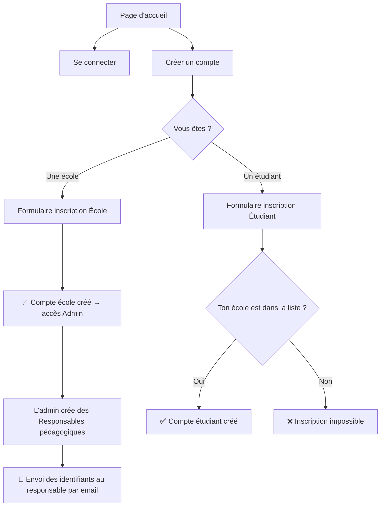
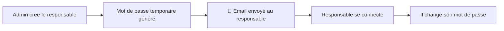

# 🔐 Système de Connexion & Inscription — Détails

## 🏗️ Les 3 flux d'inscription



---

## 1️⃣ Inscription École (Admin)

> L'école crée son compte pour administrer ses assistants de TP.

### Formulaire d'inscription — École

| Champ | Type | Obligatoire | Exemple |
|-------|------|:-----------:|---------|
| Nom de l'école | Texte | ✅ | "École Supérieure de Commerce de Paris" |
| Sigle / Acronyme | Texte | ✅ | "ESCP" |
| Domaine email | Texte | ✅ | `@escp.eu` |
| Adresse postale | Texte | ✅ | "79 Avenue de la République, 75011 Paris" |
| Ville | Texte | ✅ | "Paris" |
| Téléphone | Tél | ✅ | "01 49 23 20 00" |
| Nom du contact admin | Texte | ✅ | "Jean Dupont" |
| Email admin | Email | ✅ | "admin@escp.eu" |
| Mot de passe | Password | ✅ | ●●●●●●●● |
| Confirmer mot de passe | Password | ✅ | ●●●●●●●● |
| Logo de l'école | Fichier (image) | ❌ | logo.png |

> [!IMPORTANT]
> Le **domaine email** (`@escp.eu`) est crucial : c'est lui qui servira à vérifier que l'étudiant utilise bien un email de cette école.

---

## 2️⃣ Inscription Étudiant

> L'étudiant se crée un compte, mais **uniquement si son école est déjà enregistrée**.

### Formulaire d'inscription — Étudiant

| Champ | Type | Obligatoire | Exemple |
|-------|------|:-----------:|---------|
| École | **Menu déroulant** (liste des écoles inscrites) | ✅ | "ESCP" |
| Numéro étudiant | Texte | ✅ | "20230456" |
| Nom | Texte | ✅ | "Martin" |
| Prénom | Texte | ✅ | "Léa" |
| Email école | Email | ✅ | "lea.martin@escp.eu" |
| Téléphone | Tél | ❌ | "06 12 34 56 78" |
| Filière / Formation | Texte ou menu | ✅ | "Informatique L3" |
| Année d'études | Menu déroulant | ✅ | "L3" / "M1" / "M2" |
| Mot de passe | Password | ✅ | ●●●●●●●● |
| Confirmer mot de passe | Password | ✅ | ●●●●●●●● |

### 🛡️ Règles de validation

```
┌──────────────────────────────────────────────────────────────┐
│  L'étudiant sélectionne son école : "ESCP"                  │
│  → Le domaine attendu est : @escp.eu                        │
│                                                              │
│  Il tape son email : lea.martin@escp.eu                     │
│  → ✅ Le domaine correspond → inscription autorisée          │
│                                                              │
│  Il tape son email : lea.martin@gmail.com                   │
│  → ❌ ERREUR : "Vous devez utiliser votre email @escp.eu"   │
└──────────────────────────────────────────────────────────────┘
```

> [!TIP]
> **Logique** : Quand l'étudiant choisit une école dans le menu déroulant, on récupère le domaine email de cette école. On vérifie ensuite que l'email saisi se termine par ce domaine. Si ça ne correspond pas → message d'erreur.

### Si l'école n'est pas dans la liste

On affiche un message du type :

> ⚠️ *"Votre école n'apparaît pas dans la liste ? Cela signifie qu'elle n'est pas encore inscrite sur la plateforme. Contactez l'administration de votre école pour qu'elle crée un compte."*

---

## 3️⃣ Création d'un Responsable pédagogique (par l'Admin)

> Le responsable **ne s'inscrit PAS lui-même**. C'est l'admin de l'école qui le crée.

### Formulaire de création — Responsable (côté Admin)

| Champ | Type | Obligatoire | Exemple |
|-------|------|:-----------:|---------|
| Nom | Texte | ✅ | "Ettori" |
| Prénom | Texte | ✅ | "Eric" |
| Email | Email | ✅ | "eric.ettori@escp.eu" |
| Département / Matière | Texte ou menu | ✅ | "Informatique" |
| Téléphone | Tél | ❌ | "01 49 23 20 15" |

### Que se passe-t-il après la création ?



> [!NOTE]
> Côté frontend, tu dois juste prévoir :
> - Le formulaire de création ci-dessus
> - Un bouton "Envoyer les identifiants par email"
> - Un message de confirmation : *"Le responsable a été créé. Ses identifiants ont été envoyés à eric.ettori@escp.eu"*

---

## 📄 Récapitulatif des pages Auth

| # | Page | Accessible par | Description |
|---|------|---------------|-------------|
| 1 | **Page de connexion** | Tout le monde | Email + mot de passe |
| 2 | **Choix du type d'inscription** | Non connecté | "Je suis une école" / "Je suis un étudiant" |
| 3 | **Inscription École** | Non connecté | Formulaire complet école |
| 4 | **Inscription Étudiant** | Non connecté | Formulaire avec dropdown écoles |
| 5 | **Créer un responsable** | Admin (connecté) | Formulaire dans le panel admin |

---

## 🎨 Aperçu visuel de la page d'inscription étudiant

```
┌─────────────────────────────────────────────┐
│         🎓 Créer mon compte étudiant        │
├─────────────────────────────────────────────┤
│                                             │
│  École *                                    │
│  ┌─────────────────────────────────────┐    │
│  │ ▼ Sélectionnez votre école          │    │
│  │   ● ESCP Business School            │    │
│  │   ● Université Paris-Saclay         │    │
│  │   ● EPITECH                         │    │
│  │   ● École 42                        │    │
│  └─────────────────────────────────────┘    │
│                                             │
│  ⚠️ Votre école n'est pas listée ?          │
│  Contactez votre administration.            │
│                                             │
│  Numéro étudiant *    Année *               │
│  ┌──────────────┐     ┌──────────────┐      │
│  │ 20230456     │     │ ▼ L3        │      │
│  └──────────────┘     └──────────────┘      │
│                                             │
│  Nom *                Prénom *               │
│  ┌──────────────┐     ┌──────────────┐      │
│  │ Martin       │     │ Léa          │      │
│  └──────────────┘     └──────────────┘      │
│                                             │
│  Email école *                              │
│  ┌─────────────────────────────────────┐    │
│  │ lea.martin@escp.eu                  │    │
│  └─────────────────────────────────────┘    │
│  ✅ Email valide pour ESCP                   │
│                                             │
│  Filière *                                  │
│  ┌─────────────────────────────────────┐    │
│  │ Informatique                        │    │
│  └─────────────────────────────────────┘    │
│                                             │
│  Mot de passe *       Confirmer *           │
│  ┌──────────────┐     ┌──────────────┐      │
│  │ ●●●●●●●●     │     │ ●●●●●●●●     │      │
│  └──────────────┘     └──────────────┘      │
│                                             │
│         ┌──────────────────────┐            │
│         │   Créer mon compte   │            │
│         └──────────────────────┘            │
│                                             │
│  Déjà un compte ? Se connecter              │
└─────────────────────────────────────────────┘
```

---

## 🔄 Mise à jour du nombre total de pages

Avec ce nouveau système, on passe à **~14 pages** :

| Zone | Pages |
|------|-------|
| Auth (login + inscriptions) | 4 pages |
| Espace Étudiant | 3 pages |
| Espace Responsable | 4 pages |
| Espace Admin | 3 pages |
| **Total** | **~14 pages** |
